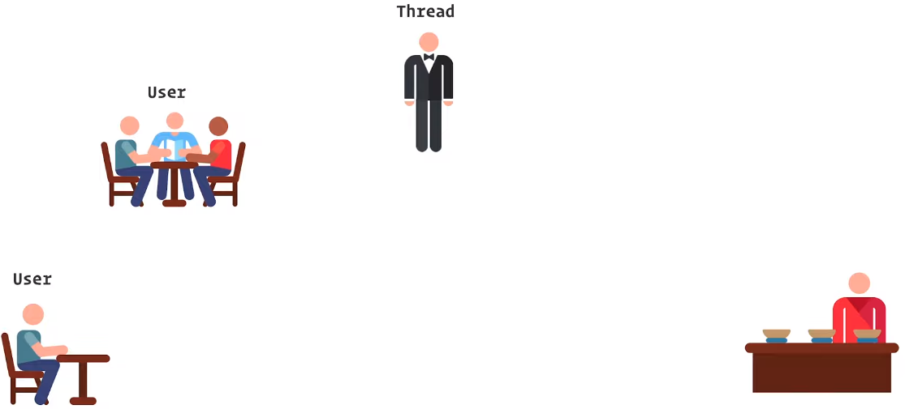
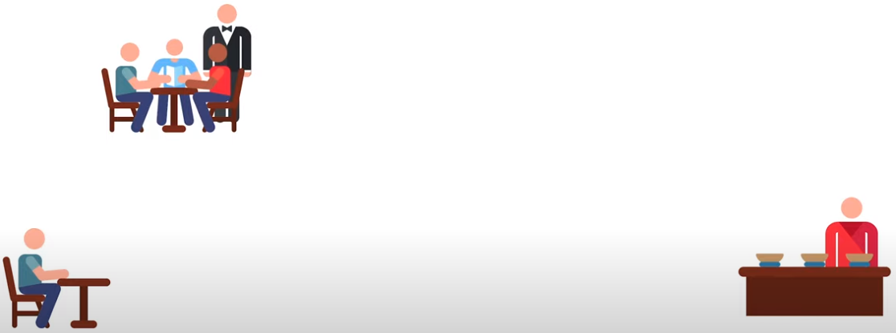
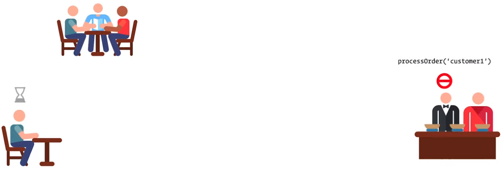
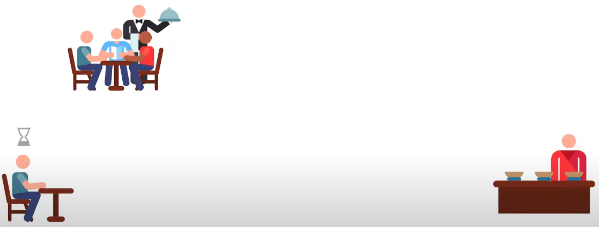
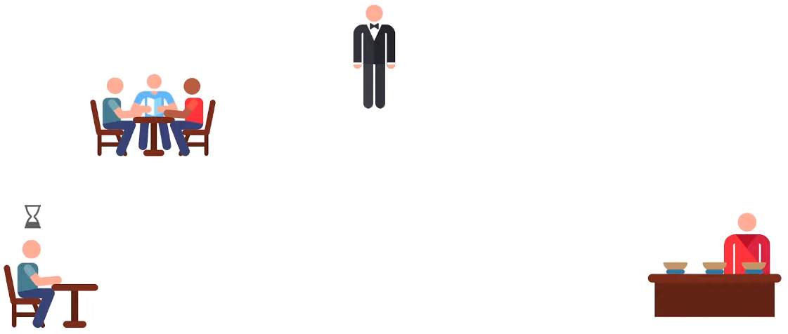
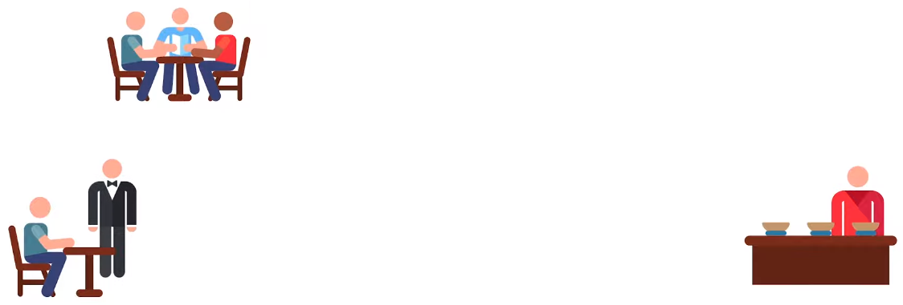
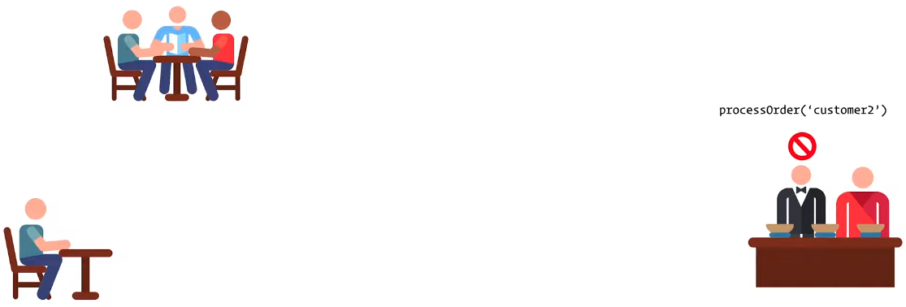
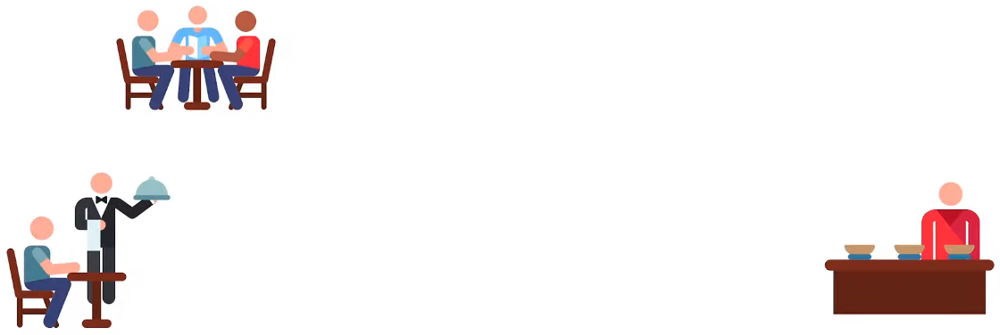
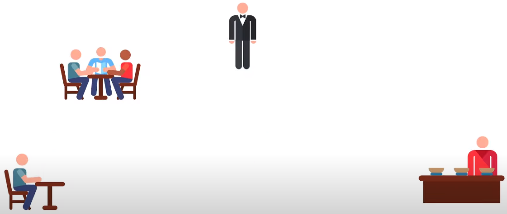

# Asynchronous in JavaScript

## Callbacks

- A callback is a funtion passed as an argument to another function
- This technique allows a function to call another function
- A callback function call run after another function has finished
- Normal function -

```js
const display = (sum) => {
  console.log(`The result is : ${sum}`)
}

const calculate = (value1, value2) => {
  const sum = value1 + value2
  return sum
}

const result = calculate(4, 5)
display(result) // Output: The result is : 9
```

- Using callback function

```js
const display = (sum) => {
  console.log(`The result is : ${sum}`)
}

const calculate = (value1, value2, callback) => {
  const sum = value1 + value2

  // Use callback function
  if (callback) callback(sum)
}

calculate(4, 5, display) // Output: The result is : 9
```

- Using callback function as anonymous function

```js
const calculate = (value1, value2, callback) => {
  const sum = value1 + value2

  // Calling anonymous callback function
  if (callback) callback(sum)
}

calculate(4, 5, function (sum) {
  console.log(`The result is : ${sum}`)
}) // Output: The result is : 9
```

- So, `callback` argument is pointing the following anonymous function

```js
function (sum) {
  console.log(`The result is : ${sum}`)
}
```

- Using callback function as arrow function

```js
const calculate = (value1, value2, callback) => {
  const sum = value1 + value2

  // Calling arrow function
  if (callback) callback(sum)
}

calculate(4, 5, (sum) => {
  console.log(`The result is : ${sum}`)
}) // Output: The result is : 9
```

- So, `callback` argument is pointing the following arrow function

```js
;(sum) => {
  console.log(`The result is : ${sum}`)
}
```

- Callback example -

```js
const paymentStatus = true
const mark = 80

const enroll = (callback) => {
  console.log('Enrollment is processing...')

  setTimeout(() => {
    if (paymentStatus) callback()
    else console.log('Enrollment process is failed')
  }, 2000)
}

const progress = (callback) => {
  console.log('Course on progress...')

  setTimeout(() => {
    if (mark >= 80) callback()
    else
      console.log(
        'You could not achieve enough marks for getting the certificate'
      )
  }, 3000)
}

const getCertificate = () => {
  console.log('Preparing your certificate...')

  setTimeout(() => {
    console.log('Congratulation!!! You earn the certificate')
  }, 2000)
}

enroll(() => {
  progress(getCertificate)
})
```

- Outcome -

```text
Enrollment is processing...

(--- 2 seconds pause ---)

Course on progress...

(--- 3 seconds pause ---)

Preparing your certificate...

(--- 2 seconds pause ---)

Congratulation!!! You earn the certificate
```

- Tips:
- Inside `enroll` function I need to point `progress` function which takes a parameter, so use arrow function and inside that function call another function

```js
;() => {
  progress(getCertificate)
}
```

- But `progress` function doesn't take any parameter, so pass direct function name as callback function -

```js
progress(getCertificate)
```

### Promise

- The previous example creates callback hell
- To get rid of it, need to use `Promise` feature of JavaScript
- `Promise` is a constructor function

```js
new Promise()
```

- Takes a function inside the constructor function

```js
// Using normal function
new Promise(function () {})

// Or using arrow function
new Promise(() => {})
```

- That function takes two functions as a parameter named `resolve` & `reject` (convention)

```js
// Using normal function
// Takes 'resolve' & 'reject' functions
new Promise(function (resolve, reject) {})

// Or using arrow function
// Takes 'resolve' & 'reject' functions
new Promise((resolve, reject) => {})
```

- The concept is -
- If `Promise` is completed or success, the `Promise` has been `resolve` or `resolve` function calls
- Else the `Promise` has been `reject` or `reject` function calls
- `Promise` definition -

```js
const promise = new Promise((resolve, reject) => {
  setTimeout(() => {
    if (status) resolve('Task 1')
    else reject(new Error('Error message'))
  })
})
```

- `Promise` calls -

```js
promise
  .then((res) => {
    console.log(res)
  })
  .catch((err) => {
    console.log(err.message)
  })
```

- Outcome if `resolve` -

```text
Task 1
```

- Outcome if `reject` -

```text
Error message
```

- Important notes:
- If I use `Promise`, then it's an asynchronous function
- If use `Promise`, either `resolve` or `reject`.
- Don't use `console.log` instead of `resolve` or `reject`
- See the above mentioned `Promise` definition
- Use `console.log` inside the function of `then` or `catch`
- See the above mentioned `Promise` call
- Same mentioned callback example using `Promise`

```js
const paymentStatus = true
const mark = 90

// Use 'Promise' so it's an asynchronous function
const enroll = () => {
  console.log('Enrollment is processing...')

  // Either 'resolve' nor 'reject'. No console.log use in 'Promise'
  return new Promise((resolve, reject) => {
    setTimeout(() => {
      if (paymentStatus) resolve()
      else reject(new Error('Enrollment process is failed'))
    }, 2000)
  })
}

const progress = () => {
  console.log('Course on progress...')

  return new Promise((resolve, reject) => {
    setTimeout(() => {
      if (mark >= 80) resolve()
      else
        reject(
          new Error(
            'You could not achieve enough marks for getting the certificate'
          )
        )
    }, 3000)
  })
}

const getCertificate = () => {
  console.log('Preparing your certificate...')

  return new Promise((resolve) => {
    setTimeout(() => {
      resolve('Congratulation!!! You earn the certificate')
    }, 2000)
  })
}

enroll()
  .then(progress)
  .then(getCertificate)
  .then((res) => {
    console.log(res)
  })
  .catch((err) => {
    console.log(err.message)
  })
```

- Outcome -

```text
Enrollment is processing...

(--- 2 seconds pause ---)

Course on progress...

(--- 3 seconds pause ---)

Preparing your certificate...

(--- 2 seconds pause ---)

Congratulation!!! You earn the certificate
```

- Tips:
- From root `Promise`, start use `then` and `catch`
- For others only use `then`
- Inside a `Promise`, if `resolve` doesn't take any parameter then call like -

```js
enroll().then(progress)
```

- Basically pass next `Promise` in `then`
- Inside a `Promise`, if `resolve` use any parameter then call like -

```js
enroll().then((res) => {
  console.log(res)
})
```

- Basically receive the parameter sent from `resolve`
- Only one `catch` will catch all the `reject`'s from all `Promise`

```js
enroll()
  .then(progress)
  .then(getCertificate)
  .then((res) => {
    console.log(res)
  })
  .catch((err) => {
    console.log(err.message)
  })
```

### Async-Await

- Use `async` so it's an asynchronous function

```js
// Normal asynchronous function
async function myFunction() {}

// Asynchronous arrow function
const myFunction = async () => {}
```

- I can only use `await` inside `async` function
- Same mentioned callback example using `async`

```js
const paymentStatus = true
const mark = 90

// Use 'Promise' so it's an asynchronous function
const enroll = () => {
  console.log('Enrollment is processing...')

  // Either 'resolve' nor 'reject'. No console.log use
  return new Promise((resolve, reject) => {
    setTimeout(() => {
      if (paymentStatus) resolve()
      else reject(new Error('Enrollment process is failed'))
    }, 2000)
  })
}

const progress = () => {
  console.log('Course on progress...')

  return new Promise((resolve, reject) => {
    setTimeout(() => {
      if (mark >= 80) resolve()
      else
        reject(
          new Error(
            'You could not achieve enough marks for getting the certificate'
          )
        )
    }, 3000)
  })
}

const getCertificate = () => {
  console.log('Preparing your certificate...')

  return new Promise((resolve) => {
    setTimeout(() => {
      resolve('Congratulation!!! You earn the certificate')
    }, 2000)
  })
}

const course = async () => {
  try {
    await enroll()
    await progress()
    const message = await getCertificate()

    console.log(message)
  } catch (err) {
    console.log(err.message)
  }
}

course()
```

- Outcome will be the same
- Before use `await`, always use `try-catch` block for error handling

## Synchronous Behavior

- JavaScript works synchronously
- Doing a lot of work at the same time
- So, JavaScript is a single-thread language
- For example:
- In a restaurent scenario, one waiter and two customers are present
- So, I can indicate the waiter as **Thread** and the customers as **User**



- Takes order from customer 1



- Move to the kitchen and wait until the food is ready to serve



- When the food become ready, serve the food to the customer



- Now, he becomes free



- After that, moves to customer 2



- Take the order and move to kitchen and wait until the food is ready



- Serve the food to customer 2



- After that, he become free



- This behavior is called **Synchronous Blocking Behavior**
- In JavaScript implementation of Synchronous Blocking Behavior -

```js
// Printing the log
const log = (anything) => {
  console.log(anything)
}

let customer = 'Customer 1'

const processOrder = (customer) => {
  log(`Move to kitchen and wait until the food is ready for ${customer}`)

  let currentTime = new Date().getTime()
  while (currentTime + 3000 >= new Date().getTime()) {}

  log(`The food is ready and served to the ${customer}`)
}

log(`Take order from ${customer}`)
processOrder(customer)
log(`Complete the order for ${customer}`)

customer = 'customer 2'

log(`Take order from ${customer}`)
processOrder(customer)
log(`Complete the order for ${customer}`)
```

- Outcome -

```text
Take order from Customer 1
Move to kitchen and wait until the food is ready for Customer 1

(--- 3 seconds pause ---)

The food is ready and served to the Customer 1
Complete the order for Customer 1
Take order from customer 2
Move to kitchen and wait until the food is ready for customer 2

(--- 3 seconds pause ---)

The food is ready and served to the customer 2
Complete the order for customer 2
```

## Asynchronous Behavior

- Same functionality in JavaScript implementation of Asynchronous Behavior

```js
// Printing the log
const log = (anything) => {
  console.log(anything)
}

let customer = 'Customer 1'

const processOrder = (customer, orderTime) => {
  log(`Move to kitchen and describe the order to chief for ${customer}`)

  // Asynchronous function
  setTimeout(() => {
    log(`The food is ready and served to the ${customer}`)
  }, orderTime)

  log(
    `Complete the order for ${customer} and ${customer} needs to wait ${orderTime} seconds`
  )
}

log(`Take order from ${customer}`)
processOrder(customer, 5000)
log(`Waiter is free for taking next order from any customer`)

customer = 'customer 2'

log(`Take order from ${customer}`)
processOrder(customer, 3000)
log(`Waiter is free for taking next order from any customer`)
```

- Outcome -

```text
Take order from Customer 1
Move to kitchen and describe the order to chief for Customer 1
Complete the order for Customer 1 and Customer 1 needs to wait 5000 seconds
Waiter is free for taking next order from any customer
Take order from customer 2
Move to kitchen and describe the order to chief for customer 2
Complete the order for customer 2 and customer 2 needs to wait 3000 seconds
Waiter is free for taking next order from any customer

(--- 3 seconds pause ---)

The food is ready and served to the customer 2

(--- 2 seconds pause ---)

The food is ready and served to the Customer 1
```

- Now, Asynchronous Behavior implementation using JavaScript callback feature

```js
// Printing the log
const log = (anything) => {
  console.log(anything)
}

const processOrder = (customer, orderTime, callback) => {
  log(`Move to kitchen and describe the order to chief for ${customer}`)

  // Asynchronous function
  setTimeout(() => {
    log(`The food is ready and served to the ${customer}`)
  }, orderTime)

  log(
    `Complete the order for ${customer} and ${customer} needs to wait ${orderTime} seconds`
  )

  callback()
}

const takeOrder = (customer, callback) => {
  log(`Take order from ${customer}`)
  callback()
}

const waiterFree = () => {
  log(`Waiter is free for taking next order from any customer`)
}

// First callback pattern
let customer = 'Customer 1'
takeOrder(customer, () => {
  processOrder(customer, 5000, () => {
    waiterFree()
  })
})

// Second callback pattern
customer = 'customer 2'
takeOrder(customer, () => {
  processOrder(customer, 3000, () => {
    waiterFree()
  })
})
```

- Outcome -

```text
Take order from Customer 1
Move to kitchen and describe the order to chief for Customer 1
Complete the order for Customer 1 and Customer 1 needs to wait 5000 seconds
Waiter is free for taking next order from any customer
Take order from customer 2
Move to kitchen and describe the order to chief for customer 2
Complete the order for customer 2 and customer 2 needs to wait 3000 seconds
Waiter is free for taking next order from any customer

(--- 3 seconds pause ---)

The food is ready and served to the customer 2

(--- 2 seconds pause ---)

The food is ready and served to the Customer 1
```

- Another way to use callback pattern

```js
let customer = 'Customer 1'
takeOrder(customer, () => {
  processOrder(customer, 5000, () => {
    waiterFree()

    customer = 'customer 2'
    takeOrder(customer, () => {
      processOrder(customer, 3000, () => {
        waiterFree()
      })
    })
  })
})
```

- Output will be the same
- Problem is the above example is creating callback hell

### Promise

- The syntax of `Promise` -

```js
const meeting = new Promise((resolve, reject) => {
  if (!hasMeeting) {
    const meetingDetails = {
      name: 'An JavaScript Interview Session',
      duration: '2 hours',
      time: '10:30 PM',
    }

    resolve(meetingDetails)
  } else {
    reject(new Error('A meeting has already scheduled'))
  }
})
```

- If only `resolve` is present in a `Promise`, then write like -

```js
const promise = Promise.resolve(123)

promise.then((res) => {
  console.log(res) // Output: 123
})
```

- Or -

```js
Promise.resolve(123).then((res) => {
  console.log(res) // Output: 123
})
```

- If only `reject` is present in a `Promise`, then write like -

```js
const promise = Promise.reject(new Error('fail'))

promise.catch((err) => {
  console.log(err.message) // Output: fail
})
```

- Or -

```js
Promise.reject(new Error('fail')).catch((err) => {
  console.log(err.message) // Output: fail
})
```

- Creating a `Promise` -

```js
const hasMeeting = false

const meeting = new Promise((resolve, reject) => {
  if (!hasMeeting) {
    const meetingDetails = {
      name: 'An JavaScript Interview Session',
      duration: '2 hours',
      time: '10:30 PM',
    }

    resolve(meetingDetails)
  } else {
    reject(new Error('A meeting has already scheduled'))
  }
})

meeting
  .then((res) => {
    console.log(JSON.stringify(res))
  })
  .catch((err) => {
    console.log(err.message)
  })
```

- If `Promise` is completed, the `Promise` has been `Resolved`

```text
{"name":"An JavaScript Interview session","duration":"2 hours","time":"10:30 PM"}
```

- Else the `Promise` has been `Rejected`

```text
A meeting has already scheduled
```

- Multiple `then` use -

```js
const hasMeeting = false

const meeting = new Promise((resolve, reject) => {
  if (!hasMeeting) {
    const meetingDetails = {
      name: 'An JavaScript Interview Session',
      duration: '2 hours',
      time: '10:30 PM',
    }

    resolve(meetingDetails)
  } else {
    reject(new Error('A meeting has already scheduled'))
  }
})

const addToCalender = (meeting) => {
  const calender = `I have a meeting titled ${meeting.name} at ${meeting.time}`

  // No need to 'reject' a 'Promise'. So, use direct 'resolve'
  return Promise.resolve(calender)
}

meeting
  .then(addToCalender)
  .then((res) => {
    console.log(res)
  })
  .catch((err) => {
    console.log(err.message)
  })
```

- If `Promise` is completed, the `Promise` has been `Resolved`

```text
I have a meeting titled An JavaScript Interview Session at 10:30 PM
```

- Else the `Promise` has been `Rejected`

```text
A meeting has already scheduled
```

- I can receive any error messages using `catch` block

### Async Await

- Same `Promise` example completed using `async` function

```js
const hasMeeting = false

const meeting = new Promise((resolve, reject) => {
  if (!hasMeeting) {
    const meetingDetails = {
      name: 'An JavaScript Interview Session',
      duration: '2 hours',
      time: '10:30 PM',
    }

    resolve(meetingDetails)
  } else {
    reject(new Error('A meeting has already scheduled'))
  }
})

const addToCalender = (meeting) => {
  const calender = `I have a meeting titled ${meeting.name} at ${meeting.time}`

  // No need to 'reject' a 'Promise'. So, use direct 'resolve'
  return Promise.resolve(calender)
}

const meetingSchecule = async () => {
  try {
    const meetingDetails = await meeting
    const calender = await addToCalender(meetingDetails)
    console.log(calender)
  } catch (err) {
    console.log(err.message)
  }
}

meetingSchecule()
```

- Outcome will be the same
- 