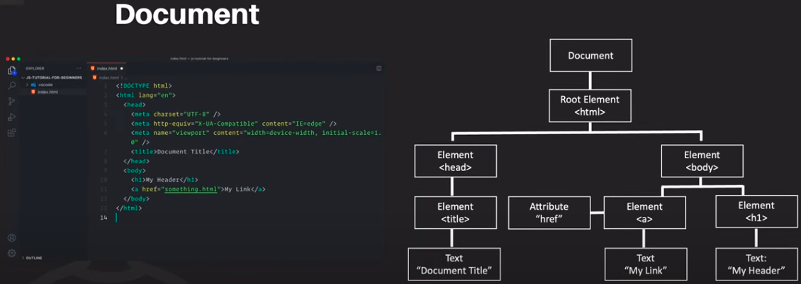
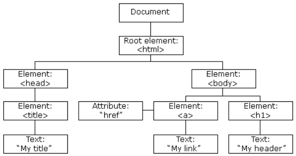
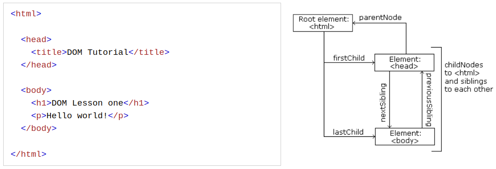

# Document Object Model

- DOM means Document Object Model



- With the object model, JavaScript gets all the power it needs to create dynamic HTML
- Now JavaScript can -
  - Change HTML elements i.e. `button`
  - Change HTML attributes i.e. `class`
  - Change CSS styles i.e. `style`
  - Add HTML elements & attributes
  - Remove HTML elements & attributes
  - React to HTML events
- So the overall concepts refer to `POEM`
  - P - Property
  - O - Object
  - E - Events
  - M - Methods
- So, DOM is a interface or API which creates connection between JavaScript & HTML
- DOM is a Document Object Model & Programming Interface for HTML that defines HTML objects, properties, methods & events to get, change, add or delete HTML elements

## DOM Methods

### `getElementById` Method

- In HTML, there will be only one `id`
- If I mention multiple `id` then using `getElementById` method will catch the first `id`
- In HTML -

```html
<p id="demo">Hello World</p>
```

- In JavaScript (DOM methods) -

```js
console.log(document.getElementById('demo'))
```

- Outcome -

```text
<p id="demo">Hello World</p>
```

- The property of that method is `innerHTML`
- Used to change the content of that selected element
- In JavaScript -

```js
const element = document.getElementById('demo')
element.innerHTML = 'Hello Prince'
```

- Outcome -

```text
<p id="demo">Hello Prince</p>
```

### `document`

- The `document` object represents the web page
- Accessing any element in an HTML page, start accessing the document object
- `document.getElementById(id)` - find an element by element id
- `document.getElementsByTagName(tagName)` - find elements by tag name
- `document.getElementsByClassName(className)` - find elements by class name

### `getElementsByTagName` & `getElementsByClassName` Method

- But `class` and `tag` will be multiple
- Returns a `HTMLCollection` which is array-like
- Could be multiple element so return `HTMLCollection`
- In HTML -

```html
<p class="demo">Hello World</p>
```

- In JavaScript -

```js
document.getElementsByTagName('p')
document.getElementsByClassName('demo')
```

### `querySelector` & `querySelectorAll` Methods

- Find all HTML elements that match a specified CSS selector (id, class name, types, attributes, values of attributes, etc) use like the following -

```html
<p class="demoClass" id="demoId">Hello World</p>
```

- In JavaScript -

```js
document.querySelector('p') // Using tag
document.querySelector('.demoClass') // Using class
document.querySelector('#demoId') // Using id

document.querySelectorAll('p') // Using tag
document.querySelectorAll('.demoClass') // Using class
// Return 'NodeList' object
```

- Can't use `querySelectorAll()` method for id
- Because id must be unique
- And that method returns `NodeList` object

## JavaScript HTML DOM

- To change the content of an HTML element

```js
document.getElementById(id).innerHTML = new_HTML
```

- To change the value of an attribute
- In HTML -

```html

<p id="demo">Hello World</p>
```

- In JavaScript -

```js
const element = document.getElementById('myImage')
element.src = 'test.png'

const pelement = document.getelementById('demo')
pelement.innerHTML = new Date()
```

- The outcome will be like -

```html

<p id="demo">Wed Aug 23 2023 19:12:38 GMT+0600 (Bangladesh Standard Time)</p>
```

- Dynamic HTML Content
- In HTML

```html
<p id="demo">Hello World</p>
```

- In JavaScript -

```js
const pelement = document.getelementById('demo')
pelement.innerHTML = new Date()
```

- The outcome will be like -

```html
<p id="demo">Wed Aug 23 2023 19:12:38 GMT+0600 (Bangladesh Standard Time)</p>
```

- `document.write()` overwrite the whole document
- Don't use it (it's recommended)

### Changing CSS

- In HTML -

```html
<p id="demo">Hello World</p>
```

- Apply CSS on it -

```css
#demo {
  color: 'red';
  font-size: 20px;
}
```

- Doing same work using JavaScript -

```js
const element = document.getElementById('demo')

// Changing CSS
element.style.color = 'red'
element.style.fontSize = '20px' // Using Camel-Case of CSS 'font-size' property
```

- CSS property value must be `string` format

### JavaScript HTML DOM Events

- `onclick` events takes function and execute that function when the user click on that element
- In HTML -

```html
<button id="myBtn" onclick="displayDate()">Click</button>
```

- Assign events using the HTML DOM
- In HTML -

```html
<button id="myBtn">Click</button>
```

- In JavaScript -

```js
document.getElementById('myBtn').onclick = displayDate

const displayDate = () => {
  console.log('Hello World')
}
```

- `onload` event is triggered when the user enters
- `onunload` event is triggered when the user leaves the page
- In HTML -

```html
<body onload="checkCookies()"></body>
```

- `onchange` event is often used in combination with validation of input fields
- It will execute when any key is pressed
- In HTML -

```html
<input type="text" id="fname" onchange="upperCase()" />
```

- `onmouseover` event can be used to triggered a function when the user mouses over
- `onmouseout` event can be used to triggered a function when the user mouses out of an HTML element
- `onmousedown` - mouse pressed
- `onmouseup` - pressed mouse released

### JavaScript HTML DOM EventListener

- Add `addEventListener` method -
- In HTML -

```html
<button id="btn">Click Me</button>
```

- In JavaScript -

```js
const element = document.querySelector('#btn')

// element.addEventListener('event', function)
element.addEventListener('click', () => {
  alert('Hello World')
})
```

- Alert will show after clicking the button
- Can add multiple event listener

```js
element.addEventListener('click', firstFunction)
element.addEventListener('mouseover', secondFunction)
element.addEventListener('mouseout', thirdFunction)
```

- Add event handler to the `window` object -

```js
window.addEventListener('resize', () => {
  document.getElementById('demo').innerHTML = someText
})
```

- Passing parameter

```js
const myf = (text) => {
  console.log(text)
}

// Using that method
element.addEventListener('click', () => {
  myf('Prince')
})
```

- Event Bubbling: Execute the inner element first then the outer one
- In HTML -

```html
<div id="div">
  <button id="btn">Click Me</button>
</div>
```

- In JavaScript -

```js
const div = document.getElementsById('div')
const btn = document.getElementsById('btn')

div.addEventListener('click', () => {
  console.log('Div')
})

btn.addEventListener('click', () => {
  console.log('Button')
})
```

- Outcome -

```text
Button
Div
```

- Event Capturing: Execute the outer element first then the inner element

- In HTML -

```html
<div id="div">
  <button id="btn">Click Me</button>
</div>
```

- In JavaScript -

```js
const div = document.getElementsById('div')
const btn = document.getElementsById('btn')

div.addEventListener(
  'click',
  () => {
    console.log('Div')
  },
  true
) // useCapture = true

btn.addEventListener(
  'click',
  () => {
    console.log('Button')
  },
  true
) // useCapture = true
```

- Outcome -

```text
Div
Button
```

- `removeEventListener` method - removes event handler that has been attached

```js
const element = document.querySelector('#btn')

// element.removeEventListener('event', function)
element.removeEventListener('click', () => {
  alert('Hello World')
})
```

## JavaScript HTML DOM Navigation

- Navigate the node tree using node relationships



- With the HTML DOM, all nodes in the node tree can be accessed by JavaScript.
- New nodes can be created
- And all nodes can be modified or deleted.
- Node relationships -



- Navigating between nodes -
- `parentNode`
- `childNodes[nodenumber]`
- `firstChild`
- `lastChild`
- `nextSibling`
- `previousSibling`
- In HTML -

```html
<p id="demo">Hello World</p>
```

- In JavaScript -

```js
document.getElementById('demo').innerHTML // Hello World
document.getElementById('demo').firstChild.nodeValue // Hello World
document.getElementById('demo').childNode[0].nodeValue // Hello World
```

- Because this text is the `firstChild` of `p` element
- DOM root nodes -
- `document.body` - the body of the document
- `document.documentElement` - the full document

## JavaScript HTML DOM Elements (Nodes)

- `appendChild()` - appended the new element as the last child of the parent
- Creating new HTML elements (nodes) -
  - Create the element (node) first
  - append it to an existing element
- In HTML -

```html
<div id="div1">
  <p id="p1">This is a paragraph.</p>
  <p id="p2">This is another paragraph.</p>
</div>
```

- In JavaScript -

```js
const para = document.createElement('p')
const node = document.createTextNode('This is new.')
para.appendChild(node)

// It will show like -
// <p>This is new.</p>

const element = document.getElementById('div1')
element.appendChild(para)
```

- The outcome -

```html
<div id="div1">
  <p id="p1">This is a paragraph.</p>
  <p id="p2">This is another paragraph.</p>
  <p>This is new.</p>
</div>
```

- `insertBefore()` - insert before a specific element
- In JavaScript -

```js
const para = document.createElement('p')
const node = document.createTextNode('This is new.')
para.appendChild(node)

const element = document.getElementById('div1')
const child = document.getElementById('p1')
element.insertBefore(para, child) // insertBefore(newElement, existingElement)
```

- `removeChild()` - remove the child
- In HTML -

```html
<div id="div1">
  <p id="p1">This is a paragraph.</p>
  <p id="p2">This is another paragraph.</p>
</div>
```

- In JavaScript -

```js
const div = document.getElementById('div1')
const p1 = document.getElementById('p1')

div.removeChild(p1)
```

- The Outcome -

```html
<div>
  <p id="p2">This is another paragraph.</p>
</div>
```

- `replaceChild()` - to replace an element
- In HTML -

```html
<div id="div1">
  <p id="p1">This is a paragraph.</p>
  <p id="p2">This is another paragraph.</p>
</div>
```

- In JavaScript -

```js
const para = document.createElement('p')
const node = document.createTextNode('This is new.')
para.appendChild(node)

// It will show like -
// <p>This is new.</p>

const div = document.getElementById('div1')
const p1 = document.getElementById('p1')

div.replaceChild(para, p1)
```

- The outcome -

```html
<div id="div1">
  <p>This is new.</p>
  <p id="p2">This is another paragraph.</p>
  <p>This is new.</p>
</div>
```

## JavaScript HTML DOM Collections

- `getElementsByTagName()` returns `HTMLCollection` object
- `HTMLCollection` object is an array-like list of HTML elements
- - In HTML -

```html
<div id="div1">
  <p id="p1">This is a paragraph.</p>
  <p id="p2">This is another paragraph.</p>
</div>
```

- In JavaScript -

```js
const p = document.getElementsTagName('p')

// Access 2nd element
console.log(p[1]) // Output: <p id="p2">This is another paragraph.</p>

// Defines the number of elements
console.log(p.length) // Output: 2

// Loop through the elements
for (let i = 0; i < p.length; i++) {
  console.log(p[i])
}
```

## JavaScript HTML DOM Node Lists

- 