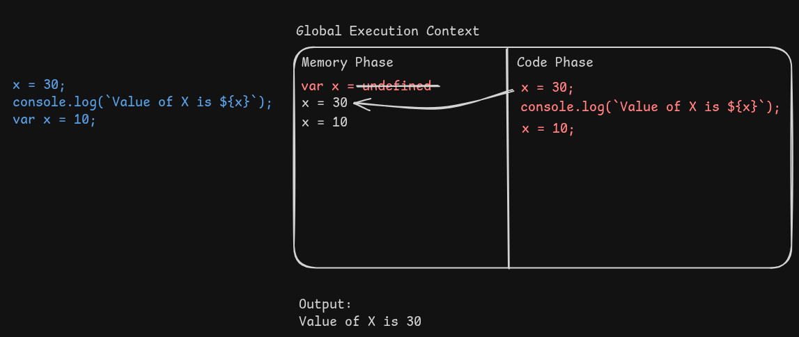
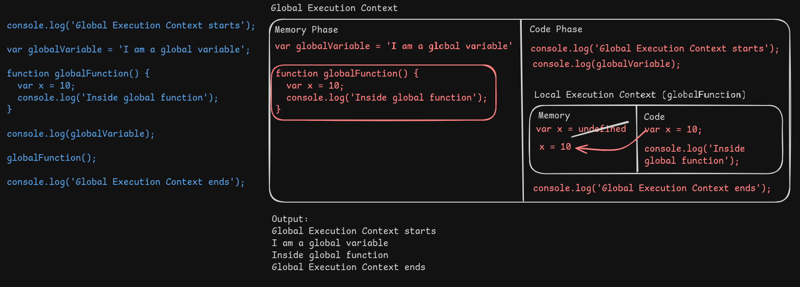
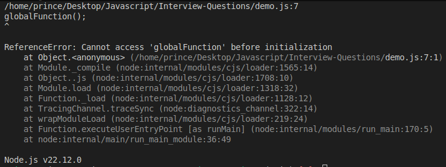
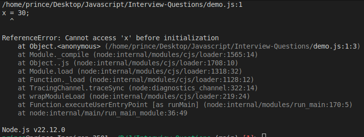

- [Global Execution Context](#global-execution-context)
  - [Hoisting](#hoisting)
  - [TDZ](#tdz)

# Global Execution Context

- While executing the JS code, JS creates a **Global Execution Context**
- It devides two parts
  - Memory Phase
  - Code Phase
- _Memory Phase:_
  - First overview & find the varibles & defines as `undefined`
  - After that update it as it's assignement
- _Code Phase:_
  - Execute the code step by step & define the output



- Function is like a variable
- So, for function, it will be in the **memory phrase**
- While executing functions, it will create **Local Execution Context**



- If I move the `globalFunction` at last the result's & execution will remain same

```js
console.log('Global Execution Context starts');

var globalVariable = 'I am a global variable';

console.log(globalVariable);

globalFunction();

console.log('Global Execution Context ends');

// Move to last
function globalFunction() {
  console.log('Inside global function');
}
```

- But if I make a variable as a function, then it won't load the whole function in the **memory phase**
- Instead, load the `globalFunction` as a variable like `globalVariable`
- That's why `globalFunction` defines `undefined`
- So, `undefined()` is not possible

```js
console.log('Global Execution Context starts');

var globalVariable = 'I am a global variable';

console.log(globalVariable);

globalFunction();

console.log('Global Execution Context ends');

// Make a variable as a function, it will create an error
const globalFunction = function () {
  console.log('Inside global function');
};
```

- The errors:



## Hoisting

- Hoisting is a concept or behavior where the declaration of a function, variable or class goes to the top of the scope they were defined in
- `var`, `let` & `const` everything is able to hoisting

```js
x = 30;

console.log(`Value of X1 is ${x}`);

var x = 30;

console.log(`Value of X2 is ${x}`);
```

- Output:

```txt
Value of X1 is 30
Value of X2 is 30
```

## TDZ

- TDZ stands for Temporal Dead Zone
- For `let` & `const`, TDZ is created
- From top to before initialization of `let` & `const` is called TDZ
- While accessing the variable inside the TDZ, it will show an error (still hoisting is happening)

```js
x = 30;

console.log(`Value of X1 is ${x}`);

let x = 30;

console.log(`Value of X2 is ${x}`);
```



- Final words:

  - TDZ is a period between the creation of a variable with `let` or `const` & its declaration
  - During this period, the variable exists but can't be accessed, resulting `ReferenceError`
