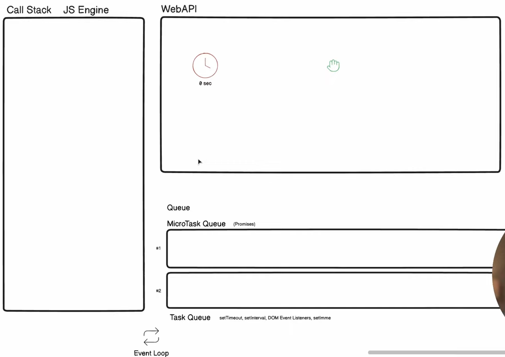

- [How JS Works](#how-js-works)
  - [Call Stack](#call-stack)
  - [WebAPI](#webapi)
  - [Callback Queue](#callback-queue)
  - [Micro-Task Queue](#micro-task-queue)
  - [Event Loop](#event-loop)
  - [Execution Order](#execution-order)
  - [Starvation In JS](#starvation-in-js)

# How JS Works

## Call Stack

- Use JS engine to manage & executes the function calls
- LIFO principle
- JS is a single threaded language
- Means, it has only one call stack & can execute one task at a time

## WebAPI

- Interfaces provided by web browsers that allow Javascript to perform complex tasks & interact with the browser
- Complex task means promises, timer related task, DOM manipulation

## Callback Queue

- After an asynchronous task is completed, its callback is added to the **Callback Queue**
- The **Event Loop** checks whether the Call Stack is empty and, if so, pushes callbacks from the queue to the call stack
- _Example:_ `setTimeout(() => console.log('Hello'), 0)` will be executed after the synchronous code finishes, despite the `0ms` timeout

## Micro-Task Queue

- **Micro-tasks** are usually created by promises.
- When a promise is resolved or rejected, the corresponding `.then()` or `.catch()` handler is added to the **Micro-task Queue**
- **Micro-tasks queue** have higher priority than **Callback Queue** (like `setTimeout` callbacks).
- Before handling any macrotasks from the callback queue, the event loop checks and clears the **Micro-task Queue**

## Event Loop

- **Event Loop** continuously checks if the **call stack** is empty
- It then processes tasks from the **Callback Queue** or **Micro-task Queue** (like Promise callbacks)
- [Event Loop Visualizer](https://www.jsv9000.app/)

## Execution Order

- Promises and async functions utilize the **microtask queue** for their resolution/rejection handlers.
- _Example:_
  - Promises' `.then()` callbacks run before `setTimeout` callbacks, even if the timeout is `0ms`
- [For more information](https://dev.to/rajatoberoi/understanding-the-event-loop-callback-queue-and-call-stack-in-javascript-1k7c)

## Starvation In JS

- A situation where a task is delayed & prevented from running as event loop is continously busy with other task or higher priority task
- **Event loop** is continuously busy keep pushing higher priority task (**Micro-Task Queue**) in the **Call Stack** & ignoring pushing **Callback Queue**'s task
