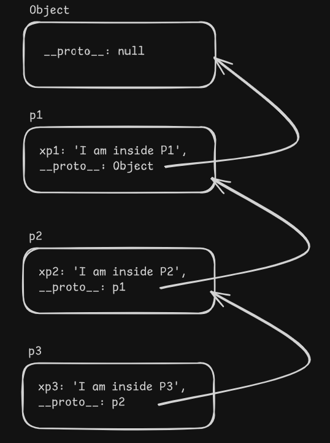

- [Prototypes \& Prototypal Inheritance](#prototypes--prototypal-inheritance)
  - [`__proto__` chain](#__proto__-chain)
  - [`__proto__` vs `prototype`](#__proto__-vs-prototype)

# Prototypes & Prototypal Inheritance

- In JS, everything is in `Object`

```js
const p1 = {
  fname: 'John',
  lname: 'Doe',
  getFullName: function () {
    return this.fname + ' ' + this.lname;
  },
};

const p2 = Object.create(p1); // Inheritance

console.log('p1 is : ', p1); // p1 is :  { fname: 'John', lname: 'Doe', getFullName: [Function: getFullName] }
console.log('p2 is : ', p2); // p2 is :  {}

// Why??
console.log('p2.fname is : ', p2.fname); // p2.fname is :  John
console.log('p2.getFullName() is : ', p2.getFullName()); // p2.getFullName() is :  John Doe
```

- Using `Object.create()` method, I can inherit everything from one object to another
- So, why `p2` is empty object?
- As: For `p1`

```js
{
  fname: 'John',
  lname: 'Doe',
  getFullName: function() {}
  __proto__: Object
}
```

- But for `p2`

```js
{
  __proto__: p1;
}
```

- `p2` is empty
- But `fname` which is present in `p1`
- While trying to access `fname` from `p2` then it will be accessed as `p2.__proto__` is pointing to `p1` object
- First trying to find in `p2`, if not found then search into `__proto__` and so on
- Now, I can change everything from `p2` which will effect in `p1` as well

```js
p2.__proto__.fname = 'Hack';

console.log('p2.fname after prototype modification is : ', p2.fname); // p2.fname after prototype modification is :  Hack
```

- `number`, `string` & `boolean` are primitive data type
- But they are inherited the property & method from their `Object` itself
- `number` is inherited from `Number()`
- `string` is inherited from `String()`
- `boolean` is inherited from `Boolean()`
- That's why for `number`, `string` & `boolean`, I can use dot notation & use the assigned properties & methods

```js
// ----------------------- String
const str = 'Prince';
// str.__proto__ => String.__proto__ => Object.__proto__ => null

// ----------------------- Number
const x = 10;
// x.__proto__ = Number.__proto__ = Object.__proto__ = null

// ----------------------- Boolean
const isAdmin = false;
// isAdmin.__proto__ = Boolean.__proto__ = Object.__proto__ = null

// ----------------------- Class
class Student {
  constructor(name) {
    this.name = name;
  }
}

const s1 = new Student();
// s1.__proto__ = Student.__proto__ = Object.__proto__ = null
```

- So, everything is in JS inherited from `Object`

## `__proto__` chain

- A

```js
const p1 = {
  xp1: 'I am inside P1',
};

const p2 = {
  xp2: 'I am inside P2',
  __proto__: p1,
};

const p3 = {
  xp3: 'I am inside P3',
  __proto__: p2,
};

console.log(p3.xp3); // I am inside P3
console.log(p3.xp2); // I am inside P2
console.log(p3.xp1); // I am inside P1
```



## `__proto__` vs `prototype`

- `__proto__` - is an object which is used to make lookup chain to resolve methods, etc
- `prototype` - a constructor function which builds `__proto__` when I create an object with `new`


