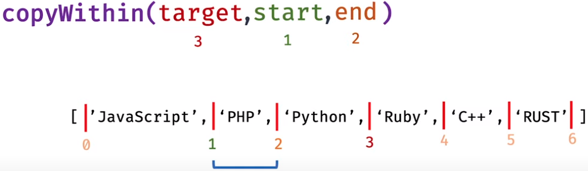
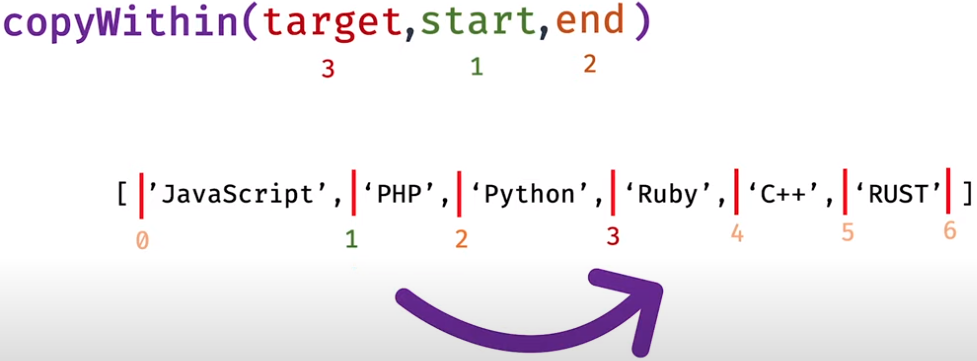
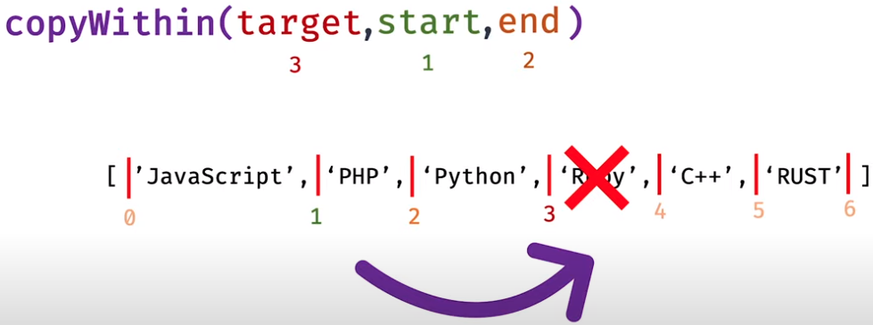
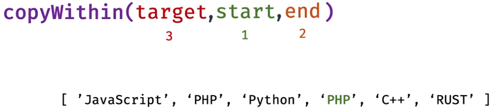
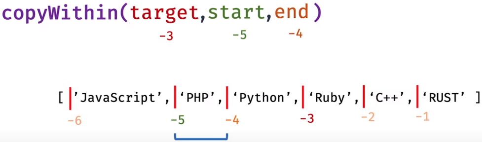
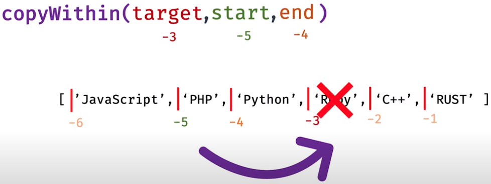
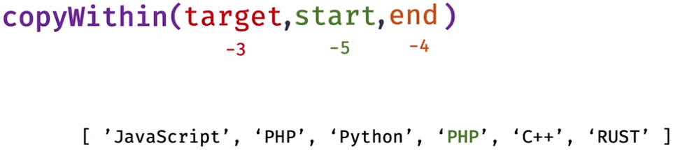

# Modern Javascript Syntax

## Arrow function

---

- Normal function

```js
function number() {
  return 10
}

console.log(number()) // Output: 10
```

- Convert it into arrow function

```js
const number = () => {
  return 10
}

console.log(number()) // Output: 10
```

- Inside arrow function, contains single statement

```js
const number = () => 10

console.log(number()) // Output: 10
```

- If function takes parameters

```js
const number = (n) => n
const sum = (a, b) => a + b

console.log(number(100)) // Output: 100
console.log(sum(10, 20)) // Output: 30
```

- Outer and inner `this` indication remain same in arrow function
- For example:

```js
const javascript = {
  name: 'Javascript',
  libraries: ['React', 'Angular', 'Vue'],
  printLibraries: function () {
    this.libraries.forEach(function (library) {
      console.log(`${this.name} loves ${library}`)
    })
  },
}

javascript.printLibraries()
```

- Output:

```text
undefined loves React
undefined loves Angular
undefined loves Vue
```

- But using arrow function, I can receive same content of the `this` object as outside

```js
const javascript = {
  name: 'Javascript',
  libraries: ['React', 'Angular', 'Vue'],
  printLibraries: function () {
    this.libraries.forEach((library) => {
      console.log(`${this.name} loves ${library}`)
    })
  },
}

javascript.printLibraries()
```

- Output:

```text
Javascript loves React
Javascript loves Angular
Javascript loves Vue
```

- All normal functions in JS is itself a constructor function
- But arrow function does not

## Truthy / Falsy

---

- False values are `false`, `0`, `""`, `null`, `undefined` & `NaN`

## Ternary Operator

---

- Normal `if/else` statement

```js
const a = 5

let access
if (a > 5) {
  access = true
} else {
  access = false
}

console.log(access) // Output: false
```

- Using ternary operator

```js
const a = 5

let access = a > 5 ? true : false
console.log(access) // Output: false
```

- Multi-level `if/else` statement

```js
const age = 14

let type
if (age > 18) {
  type = 'Adult'
} else {
  if (age > 10) {
    type = 'Young'
  } else {
    type = 'Child'
  }
}

console.log(type) // Output: Young
```

- Using ternary operator, the code will be shorten

```js
const age = 14
const type = age > 18 ? 'Adult' : age > 10 ? 'Young' : 'Child'

console.log(type)
```

## `find()` Method

---

- Could't change the main array
- Return the first element for which the condition is `true`

```js
const numbers = [1, 2, 3, 4, 5, 6, 7, 8, 9, 10]

const result = numbers.find((value) => {
  return value > 4
})

console.log(result) // Output: 5
```

- Inside `find()` function, not only access values of that array
- But also access the index and that array too

```js
const numbers = [10, 20, 30, 40, 50, 60, 70, 80, 90, 100]

const result = numbers.find((value, index, arr) => {
  console.log(value, index, arr)
  return value > 40
})

console.log(result)
```

- Output:

```text
10 0 [10, 20, 30, 40, 50, 60, 70, 80, 90, 100]
20 1 [10, 20, 30, 40, 50, 60, 70, 80, 90, 100]
30 2 [10, 20, 30, 40, 50, 60, 70, 80, 90, 100]
40 3 [10, 20, 30, 40, 50, 60, 70, 80, 90, 100]
50 4 [10, 20, 30, 40, 50, 60, 70, 80, 90, 100]
50
```

- `find()` function takes 2nd parameter as `this`
- For example:

```js
class Student {
  constructor(name, age) {
    this.name = name
    this.age = age
  }

  test() {
    console.log('Hello')
  }

  exampleFunction() {
    const arr = [1, 2, 3]

    // Takes 2nd parameter
    arr.find(function () {
      this.test()
    }, this)
  }
}

const student = new Student('Prince', 10)
student.exampleFunction()
```

- Output:

```text
Hello
Hello
Hello
```

- If I use arrow function, no need to pass 2nd parameter as `this`

```js
class Student {
  constructor(name, age) {
    this.name = name
    this.age = age
  }

  test() {
    console.log('Hello')
  }

  exampleFunction() {
    const arr = [1, 2, 3]
    arr.find(() => {
      this.test()
    })
  }
}

const student = new Student('Prince', 10)
student.exampleFunction()
```

- Output: same as before

## `findIndex()` Method

---

- Could't change the main array
- Takes 3 parameters, i.e. `value`, `index` and `arr`
- Returns the array index where the condition is `true`
- If the condition is `false`, return `-1`

```js
const number = [10, 20, 30, 40, 50, 60]

const result = number.findIndex((value, index, arr) => {
  return value > 35
})

console.log(result) // Output: 3

const result2 = number.findIndex((value) => {
  return value > 100
})

console.log(result2) // Output: -1
```

- `findIndex()` function takes 2nd parameter as `this` too

## `filter()` Method

---

- Could't change the main array
- Takes 3 parameters, i.e. `value`, `index` and `arr`
- Returns a new array for which case the condition is `true`

```js
const number = [10, 20, 30, 40, 50, 60]

const result = number.filter((value) => {
  return value > 35
})

console.log(result) // Output: [40, 50, 60]
```

## `slice()` Method

---

- Couldn't change main array
- 1st parameter: +ve = start from front, -ve = start from end

```js
const number = [10, 20, 30, 40, 50, 60]

const result = number.slice(1, 3)
console.log(result) // Output: [20, 30]

// [10, 20, 30, 40, 50, 60]
//      ^   ^
//      1   3
//     1st 2nd

const result2 = number.slice(-2, 5)
console.log(result2) // Output: [50]

// [10, 20, 30, 40, 50, 60]
//                  ^
//                 -2 - 1st
//                  5 - 2nd
```

## `splice()` Method

- Change the main array
- 1st parameter: +ve = start from front, -ve = start from end
- 2nd parameter: how many element I want to remove
- Rest parameters: Which elements I want to replace
- Returns an array contains removed elements

```js
const number = [10, 20, 30, 40, 50, 60]

const result = number.splice(1, 2, 100, 200, 300)
console.log(result) // Output: [20, 30]
console.log(number) // Output: [10, 100, 200, 300, 40,  50,  60]

// [10, 20, 30, 40, 50, 60]
//      ^
//      1
//     1st
//     ^-----^
//       2nd
//     100, 200, 300
//     Rest parameters

const number1 = [10, 20, 30, 40, 50, 60]
const result1 = number1.splice(-2, 5, 100, 200)
console.log(result1) // Output: [50, 60]
console.log(number1) // Output: [10, 20, 30, 40, 100, 200]

// [10, 20, 30, 40, 50, 60]
//                  ^
//                 -2
//                 1st
//                 ^-----^
//                   2nd
//                 100, 200, 300
//                 Rest parameters
```

## `concat()` Method

---

- Couldn't change the main array
- Returns new array which contains all the elements
- I can concatenation multiple array

```js
const number1 = [1, 2, 3]
const number2 = [10, 20, 30]
const number3 = [100, 200, 300]

const result = number1.concat(number2)
console.log(result) // Output: [1, 2, 3, 10, 20, 30]

const result2 = number1.concat(number2, number3)
console.log(result2) // Output: [1, 2, 3, 10, 20, 30, 100, 200, 300]
```

## `push()` Method

---

- Modify the array
- Returns the new length of the modified array

```js
const numbers = [1, 2, 3, 4, 5]

let result = numbers.push(10)
console.log(numbers) // Output: [1, 2, 3, 4, 5, 10]
console.log(result) // Output: 6

result = numbers.push(10, 11, 12)
console.log(numbers) // Output: [1, 2, 3, 4, 5, 10, 10, 11, 12]
console.log(result) // Output: 9

result = numbers.push([100, 200])
console.log(numbers) // Output: [1, 2, 3, 4, 5, 10, 10, 11, 12, [100, 200]]
console.log(result) // Output: 10
```

## `map()` Method

---

- Couldn't change the main array
- Must return all the elements inside the arrow function
- Used to traverse the array

```js
const numbers = [10, 20, 30, 40]

const result = numbers.map((num) => {
  return 2 * num
})

console.log(result) // Output: [20, 40, 60, 80]
console.log(numbers) // Output: [10, 20, 30, 40]
```

## `reduce()` Method

- Couldn't change the main array
- 1st parameter: previously returned value
- 2nd parameter: current value
- 3rd parameter: index of the current value
- 4th parameter: takes the whole array

```js
const numbers = [1, 2, 3, 4, 5]

const sum = numbers.reduce((prev, current) => {
  return prev + current
})

console.log(sum) // Output: 15
```

## `for in` loop

---

- Iterates an object, array and string
- Receive the propery for object & index for array and string

```js
// Object
const myObj = {
  name: 'Javascript',
  estd: '1995',
  founder: 'Brendan Eich',
}
for (property in myObj) {
  console.log(`Property: ${property}, and Value: ${myObj[property]}`)
}

// Array
const myArray = [10, 20, 30, 40, 50]
for (value in myArray) {
  console.log(value)
}

// String
const str = 'Prince'
for (ch in str) {
  console.log(ch)
}
```

- Output:

```text
// For Object
Property: name, and Value: Javascript
Property: estd, and Value: 1995
Property: founder, and Value: Brendan Eich

// For Array
0 1 2 3 4

// For String
0 1 2 3 4 5
```

- Iterates only an array and string
- Return the value of an array and the element of the string

```js
// Array
const myArray = [10, 20, 30, 40, 50]

for (value of myArray) {
  console.log(value)
}

// String
const str = 'Prince'
for (ch of str) {
  console.log(ch)
}
```

- Output:

```text
// For Array
10 20 30 40 50

// For String
P r i n c e
```

## Important Object Tricks

---

- `Object.keys()` returns the keys or properties in the form of an array
- `Object.values()` returns the values in the form of an array
- `Object.entries()` returns the keys and values in the form of an 2d array

```js
const myObj = {
  name: 'Javascript',
  estd: '1995',
  founder: 'Brendan Eich',
}

const keys = Object.keys(myObj)
console.log(keys) // Output: [ 'name', 'estd', 'founder' ]

const values = Object.values(myObj)
console.log(values) // Output: [ 'Javascript', '1995', 'Brendan Eich' ]

const entries = Object.entries(myObj)
console.log(entries)

// Output
// [
//   [ 'name', 'Javascript' ],
//   [ 'estd', '1995' ],
//   [ 'founder', 'Brendan Eich' ]
// ]
```

- If property and assigned variable both are same named as same, then I can shorten the property name like -

```js
const x = 10
const y = 15

const myObj = {
  name: 'Javascript',
  estd: '1995',
  founder: 'Brendan Eich',
  x,
  y,
}

console.log(myObj)
```

- Output:

```text
{
  name: 'Javascript',
  estd: '1995',
  founder: 'Brendan Eich',
  x: 10,
  y: 15
}
```

## Default Parameter

---

- Set a default value at the last parameter of the function
- If I don't provide any value then use default parameter
- If I provide the value then apply that provided value

```js
function greeting(name, message = 'Good Morning!') {
  console.log(`Hello ${name}, ${message}`)
}

greeting('Prince') // Output: Hello Prince, Good Morning!
greeting('Prince', 'Good Afternoon!') // Output: Hello Prince, Good Afternoon!
```

## Spread Operator

---

- Couldn't modify the main array
- Make a copy and add to the new array

```js
const number = [1, 2, 3]

const newNumber = [...number, 10, 20]
console.log(number) // Output: [1, 2, 3]
console.log(newNumber) // Output: [1, 2, 3, 10, 20]
```

- If I modify the main array, It won't modify the new one and vice versa

```js
const number = [1, 2, 3]
const newNumber = [...number, 10, 20]

number.push(100) // Add a new element

console.log(number) // Output: [1, 2, 3, 100]
console.log(newNumber) // Output: [1, 2, 3, 10, 20]
```

- Multiple spread operators in a single array

```js
const number = [1, 2, 3]
const number2 = [11, 22, 33]

const newNumber = [...number, 100, 200, ...number2]

console.log(newNumber) // Output: [1, 2, 3, 100, 200, 11, 22, 33]
```

- Spread operator in an object

```js
const person = {
  name: 'Prince',
  age: 22,
}

const newPerson = { ...person, position: 'Software Engineer', salary: '15k' }

console.log(newPerson)
```

- Output:

```text
{
  name: 'Prince',
  age: 22,
  position: 'Software Engineer',
  salary: '15k'
}
```

- If I assign, not to take as copy but as a reference

```js
const numbers = [1, 2, 3]

const newNumber = numbers

console.log(numbers) // Output: [1, 2, 3]
console.log(newNumber) // Output: [1, 2, 3]

numbers[0] = 100

console.log(numbers) // Output: [100, 2, 3]
console.log(newNumber) // Output: [100, 2, 3]
```

## Rest Operator

---

- Must be last argument in the funciton parameter
- Received all the elements in the function

```js
function myFunc() {
  console.log(arguments) // Output: [Arguments] { '0': 1, '1': 2, '2': 3, '3': 4, '4': 5 }
  console.log(arguments[0]) // Output: 1
}

myFunc(1, 2, 3, 4, 5)
```

- Grabs all the parameters in the funciton

```js
function myFunc(...params) {
  console.log(params) // Output: [1, 2, 3, 4, 5]
}

myFunc(1, 2, 3, 4, 5)
```

- Grabs a few parameters in the function

```js
function myFunc(a, ...params) {
  console.log(a) // Output: 1
  console.log(params) // Output: [2, 3, 4, 5]
}

myFunc(1, 2, 3, 4, 5)
```

## Object Destructuring

- Fetching the value of a property of an object

```js
const user = {
  id: '123',
  name: 'Prince',
  age: 23,
}

const name = user.name
console.log(name) // Output: Prince

// Alternative way
const name1 = user['name']
console.log(name1) // Output: Prince
```

- While using nested object, then will face problems
- Need to use object destructuring
- Basically fetching the property's value from that object
- Store that value to any variable

```js
const user = {
  id: '123',
  name: 'Prince',
  age: 23,
}

const { name } = user
console.log(name) // Output: Prince
```

- Using alias

```js
const user = {
  id: '123',
  name: 'Prince',
  age: 23,
}

const { name: title } = user
console.log(title) // Output: Prince
```

- Use object destructuring in nested object

```js
const user = {
  id: '123',
  name: 'Prince',
  age: 23,
  education: {
    degree: 'Masters',
  },
}

const {
  education: { degree },
} = user

console.log(degree) // Output: Masters
```

- Using alias in nested object

```js
const user = {
  id: '123',
  name: 'Prince',
  age: 23,
  education: {
    degree: 'Masters',
  },
}

const {
  education: { degree: deg },
} = user

console.log(deg) // Output: Masters
```

- If `eduction` object is not present, then the last program shows error
- To remove the error (if not found out `eduction` object), use default value

```js
const user = {
  id: '123',
  name: 'Prince',
  age: 23,
}

const { education: { degree } = {} } = user

console.log(degree) // Output: undefined
```

## Array Destructuring

- Fetching the elements of an array

```js
const numbers = [1, 2, 4, 5, 6]

const [a, b] = numbers

console.log(a) // Output: 1
console.log(b) // Output: 2
```

- Skip some elements of an array
- For example, fetching 2nd & 5th elements

```js
const numbers = [1, 2, 4, 5, 6]

const [, a, , , b] = numbers

console.log(a) // Output: 2
console.log(b) // Output: 6
```

- In nested array

```js
const numbers = [1, 2, [100, 200, 300, 400], 4, 5, 6]

const [, , [, a, b]] = numbers

console.log(a) // Output: 200
console.log(b) // Output: 300
```

## Import / Export

- Need to create `package.json` file for supporting import and export
- In `package.json` file -

```js
{
  "type": "module"
}
```

### Named Export

- Export multiple values or functions
- Exported variable or function name must match when importing
- In `first.js` file -

```js
export const pi = 3.14
export const a = 2.9

export function greeting() {
  console.log('Good morning...')
}
```

### Named Import

- Importing all values and functions
- Import values or function inside `{}`
- In `second.js` file -

```js
import { a, pi, greeting } from './first.js'

console.log(a, pi) // Output: 2.9 3.14
greeting() // Output: Good morning...
```

- Using `*` alias to catch multiple named imported value

```js
import * as value from './first.js'

// Stored all imported variables and funcitons in 'value' object
console.log(value)

// Output:
// [Module: null prototype] {
//   a: 2.9,
//   greeting: [Function: greeting],
//   pi: 3.14
// }

// Calling imported (named) variables
console.log(value.a, value.pi) // Output: 2.9 3.14

// Calling imported (named) function
value.greeting() // Output: Good morning...
```

- Using single single aliases to catch multiple named imported value

```js
import { a as newA, pi as newPi, greeting as newGreeting } from './first.js'

// Calling imported (named) variables
console.log(newA, newPi) // Output: 2.9 3.14

// Calling imported (named) function
newGreeting() // Output: Good morning...
```

### Default Export

- Can't use multiple default export
- May not match exported variable or function while importing
- Variable export (default)
- In `first.js` file -

```js
const a = 2.9
export default a
```

- Function export (default)

```js
function greeting() {
  console.log('Good morning...')
}
export default greeting
```

- Another way to use default export for function

```js
export default function greeting() {
  console.log('Good morning...')
}
```

- But while using arrow function, then use like exporting a varialbe

```js
const greeting = () => {
  console.log('Good morning...')
}

export default greeting
```

### Default Import

- Importing the value which is passed to other file using default export
- In `second.js` file -

```js
import aa from './first.js'

console.log(aa) // Output: 2.9
```

- Importing the function which is passed to other file using default export
- In `second.js` file -

```js
import anotherGreeting from './first.js'

anotherGreeting() // Output: Good morning...
```

- Default import/export & named import/export together
- In `first.js` file -

```js
export const pi = 3.14

const a = 2.9
export default a
```

- In `second.js` file -

```js
import a, { pi } from './first.js'

console.log(a, pi)
```

## Template Literals

- normal or problematic way

```js
const a = 5
const b = 6

console.log('I am ' + a + ' and I am ' + b) // Output: I am 5 and I am 6
```

- Using template literals

```js
const a = 5
const b = 6

console.log(`I am ${a} and I am ${b}`) // Output: I am 5 and I am 6
```

- Conduct arithmetic operation

```js
console.log(`I am ${a + b}`) // Output: I am 11
```

- Approve multi-line indentation

```js
console.log(`I am test 

        This is test`)
// Output:
// I am test

//         This is test
```

## Tagged Template Literals

- Basically modify the template literals as per requirements

```js
function modifier(strings, ...values) {
  console.log(strings) // Output: [ 'We have ', ' and ', ' in our cricket team.' ]
  console.log(values) // Output: [ 'Sakib', 'Tamim' ]

  const newStrings = strings.reduce((prev, current) => {
    return prev + current + (values.length ? `Mr. ${values.shift()}` : '')
  }, '')

  return newStrings
}

const player1 = 'Sakib'
const player2 = 'Tamim'

console.log(modifier`We have ${player1} and ${player2} in our cricket team.`) // Output: We have Mr. Sakib and Mr. Tamim in our cricket team.
```

## Sets

- `Set` is reference data type
- `Set` is not same as an array
- Stores unique data
- `Set` area created with `new` keyword

```js
const myArray = [] //  Literal syntax
const myArray2 = new Array() // Constructor syntax

let mySet = new Set()
console.log(mySet) // Output: Set(0) {}
```

- Any data can be added into `Set`

```js
// Insert an element
mySet.add(10)
mySet.add('Bangladesh')

console.log(mySet) // Output: Set(2) { 10, 'Bangladesh' }
```

- Delete data from `set` element

```js
mySet.delete('Bangladesh')

console.log(mySet) // Output: Set(2) { 10 }
```

- Check an element is present or not in `Set`

```js
console.log(mySet.has('Bangladesh')) // Output: false
```

- We can do method chaining with `Set` methods
- Because the methods are returning the modified `Set`

```js
mySet.add(5).add(6).add('Bangladesh').delete(5)

console.log(mySet) // Output: Set(2) { 6, 'Bangladesh' }
```

- Clears all the elements

```js
mySet.add(5).add(6).add('Bangladesh').clear()

console.log(mySet) // Output: Set(0) {}
```

- Returns the length of the `Set`

```js
mySet.add(5).add(6).add('Bangladesh')

console.log(mySet.size) // 3
```

- We can pass any iterable in `Set`
- First iterable - `Array`
- Create `Set` from `Array`:

```js
let myArray = [1, 2, 4, 4, 1, 3]
let mySet = new Set(myArray)

// Store only unique values
console.log(mySet) // Output: Set(4) { 1, 2, 4, 3 }
```

- First iterable - `String`
- Create `Set` from `String`:

```js
let mySet = new Set('ABCCB')

console.log(mySet) // Output: Set(3) { 'A', 'B', 'C' }
```

- `Set` is iterable

```js
let mySet = new Set('ABCCB')

for (let value of mySet) {
  console.log(value)
}

// Output:
// A
// B
// C
```

- Different between `Set` and `Array` is
- `Set` stores unique value, but `Array` stores repeated value
- `Set` is not maintaining order, but `Array` maintains order
- Create `Array` from `Set`:

```js
let mySet = new Set('ABCCB')

// Method 1 (Recommended - easy to use)
console.log([...mySet]) // Output: [ 'A', 'B', 'C' ]

// Method 2
console.log(Array.from(mySet)) // Output: [ 'A', 'B', 'C' ]
```

- Conduct any operation in `Set`:
- Step 1: Convert `Array` from `Set`
- Step 2: Conduct operation
- Step 3: Convert `Set` from `Array` again
- Usage:
- `Set` is used to get unique elements from an array

```js
let myArray = [1, 2, 3, 4, 5, 5, 5, 5, 6, 5]

console.log([...new Set(myArray)]) // Output: [ 1, 2, 3, 4, 5, 6 ]
```

- Union, Intersection, Difference

```js
const a = new Set([1, 2, 3])
const b = new Set([1, 3, 5])

const union = new Set([...a], [...b])
console.log(union) // Output: Set(3) { 1, 2, 3 }

const intersection = new Set([...a].filter((x) => b.has(x)))
console.log(intersection) // Output: Set(3) { 1, 3 }

const difference = new Set([...a].filter((x) => !b.has(x)))
console.log(difference) // Output: Set(1) { 2 }
```

## WeakSet

- We must add object to `WeakSet`
- Available methods: `add`, `delete` & `has`

```js
// Array of object
const ws = new WeakSet([{ a: 1 }, { b: 2 }])
```

- Add an element

```js
ws.add({ a: 1 })
```

- `WeakSet` are not iterables
- Usage:
- I can access any methods of class using `prototype`

```js
class someClass {
  constructor() {}

  method() {
    console.log('This method can be accessed')
  }
}

someClass.prototype.method() // Output: This method can be accessed
```

- But it should not be accessed
- Using `WeakSet`, force to create an object to access its method

```js
const ws = new WeakSet()

class someClass {
  constructor() {
    ws.add(this)
  }

  method() {
    if (!ws.has(this)) {
      throw new Error('Can not be accessed')
    }

    console.log('This method can be accessed')
  }
}

const sc = new someClass()
sc.method() // Output: This method can be accessed
```

## `copyWithin()` Method

- Copy all the elements from `start` to `end` and replace it at `target`
- `target`, `start` & `end` are array index or position
- if `target`, `start` & `end` are +ve's
- Takes the range I want to copy



- Find the target position



- Mark the array position where I want to replace



- Replace with the element



- if `target`, `start` & `end` are -ve's
- Must: `start < end`



- Takes the range I want to copy
- Find the target position
- Mark the array position where I want to replace



- Replace with the element



- This method has 6 properties
  - `target` is required
  - `start` defaults to `0`
  - `end` defaults to `array.length`
  - Never changes `array.length`
  - Overwrites original `array`
  - Returns modified `array`
- Examples: 01 -> `end` is absent

```js
const a = ['JavaScript', 'PHP', 'Python', 'Ruby', 'C++', 'RUST']

a.copyWithin(3, 2)
console.log(a) // Output: [ 'JavaScript', 'PHP', 'Python', 'Python', 'Ruby', 'C++' ]
```

- Examples: 02 -> `target` is out of the `array.length`

```js
const a = ['JavaScript', 'PHP', 'Python', 'Ruby', 'C++', 'RUST']

a.copyWithin(6, 1, 2)
console.log(a) // Output: [ 'JavaScript', 'PHP', 'Python', 'Ruby', 'C++', 'RUST' ]
```

- Examples: 03 -> `start` and `end` are absent

```js
const a = ['JavaScript', 'PHP', 'Python', 'Ruby', 'C++', 'RUST']

a.copyWithin(3)
console.log(a) // Output: [ 'JavaScript', 'PHP', 'Python', 'JavaScript', 'PHP', 'Python' ]
```

- Examples: 04 -> `start > end`, so no copy

```js
const a = ['JavaScript', 'PHP', 'Python', 'Ruby', 'C++', 'RUST']

a.copyWithin(3, -1, -2)
console.log(a) // Output: [ 'JavaScript', 'PHP', 'Python', 'Ruby', 'C++', 'RUST' ]
```

- Examples: 05 -> Now `start < end`

```js
const a = ['JavaScript', 'PHP', 'Python', 'Ruby', 'C++', 'RUST']

a.copyWithin(3, -2, -1)
console.log(a) // Output: [ 'JavaScript', 'PHP', 'Python', 'C++', 'C++', 'RUST' ]
```

- 