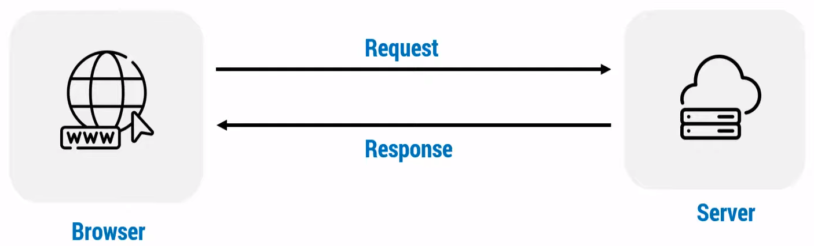
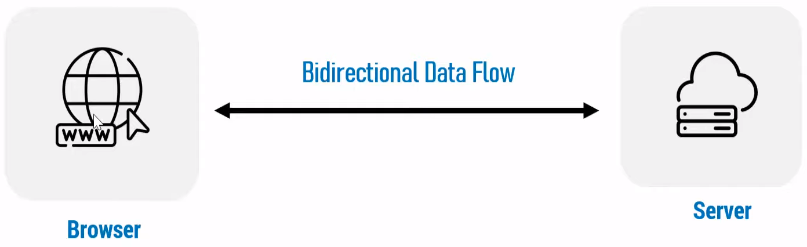
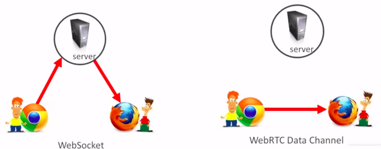

# Table Of Contents

- [Table Of Contents](#table-of-contents)
- [Socket.IO](#socketio)
  - [What is Web Socket \& how it works?](#what-is-web-socket--how-it-works)
    - [Normal Case:](#normal-case)
    - [By Using Socket:](#by-using-socket)
  - [Socket vs WebRTC](#socket-vs-webrtc)
  - [Create New Project With Socket](#create-new-project-with-socket)
  - [Create A New Project](#create-a-new-project)
  - [A](#a)

# Socket.IO

## What is Web Socket & how it works?

- Use case
  - Real-time communication
  - Bidirectional Communication
  - Between browser-server communication

### Normal Case:

- In HTTP, HTTPS protocol:
- Browser sends a request (GET, POST, PUT, DELETE) to the server
- Server returns a response based on received request
- _Condition:_ Only after receiving request, return a response. Otherwise do nothing
- New connection is established while sending request
- Connection lost/close after receiving a response from the server
- So, every new request creates a new connection
- So, real time communication is not possible



### By Using Socket:

- In `ws` (Web Socket) protocol:
- Establish a bidirectional/continuous connection between browser & server
- Data transmission is not depended on request-response modal



## Socket vs WebRTC

| WebSocket                                                         | WebRTC                                                                  |
| ----------------------------------------------------------------- | ----------------------------------------------------------------------- |
| Uses UDP protocol                                                 | Uses TCP protocol                                                       |
| Communication between server to browser & vice versa              | Communication between browser to browser                                |
| Designed for bi-directional communication between client & server | Designed for high performance, high quality video & audio communication |
| Doesn't need STUN/TURN Server                                     | Need STUN/TURN Server                                                   |



- _UDP:_ User Datagram Protocol
- _TCP_ Transmission Control Protocol

## Create New Project With Socket

- Create `package.json` file:

```cmd
npm init --y
```

- Install `Express JS`:

```cmd
npm i express --save
```

- Install `Socket.io`:

```cmd
npm i socket.io
```

- For server side, create `index.js` file
- For client side, create `index.html` file

## Create A New Project

- In `index.js` file:

```js
const express = require('express')
const http = require('http')

const app = express()
const server = http.createServer(app) // Create a server

// For URL -> http://localhost:3000/
app.get('/', (req, res) => {
  res.sendFile(__dirname + '/index.html')
})

// Server listen port
server.listen(3000, () => {
  console.log('Server run at 3000 port')
})
```

- In `index.html` file:

```html
<!DOCTYPE html>
<html lang="en">
  <head>
    <meta charset="UTF-8" />
    <meta name="viewport" content="width=device-width, initial-scale=1.0" />
    <title>Socket Learning</title>
  </head>
  <body>
    <h1>Hello</h1>
  </body>
</html>
```

## A

- Configure socket in server side:

```js
const { Server } = require('socket.io')

const app = express()
const server = http.createServer(app)
const io = new Server(server)
```
