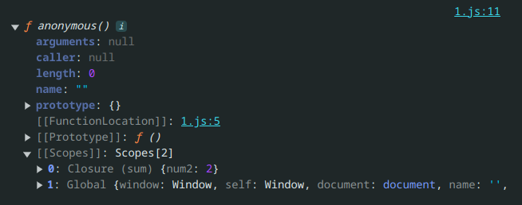
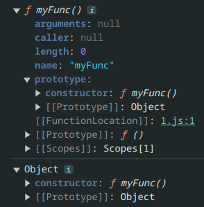
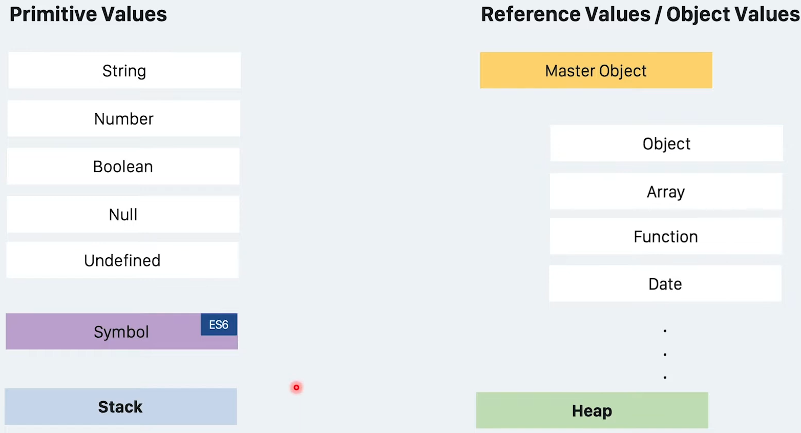
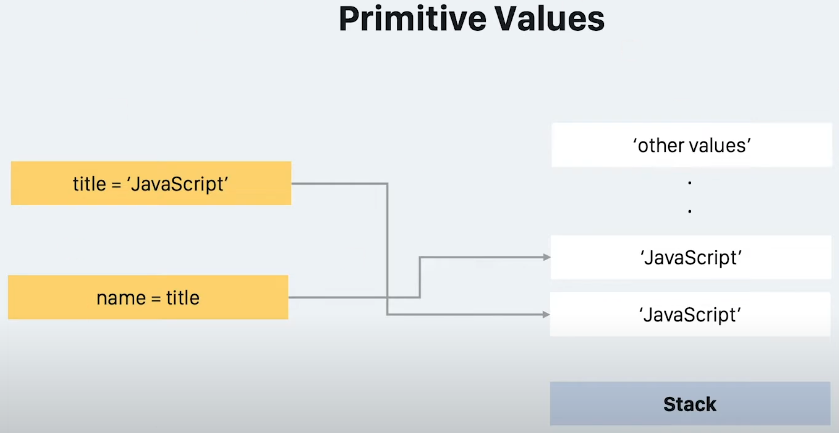
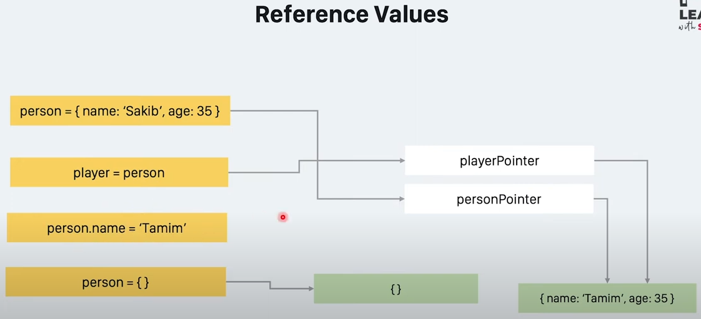
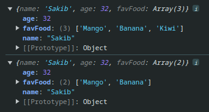

# Table Of Content

- [Table Of Content](#table-of-content)
  - [Closures](#closures)
  - [Hoisting](#hoisting)
  - [Prototype](#prototype)
  - [Prototype Inheritance \& ES6 Class](#prototype-inheritance--es6-class)
  - [`this` Keyword](#this-keyword)
    - [Implicit Binding](#implicit-binding)
    - [Explicit Binding](#explicit-binding)
    - [`new` Binding](#new-binding)
    - [`Window` Binding](#window-binding)
  - [Execution Context](#execution-context)
  - [Higher Order Functions](#higher-order-functions)
  - [Primitive vs Reference](#primitive-vs-reference)
    - [Mutable Copy vs Immutable Copy vs Deep copy](#mutable-copy-vs-immutable-copy-vs-deep-copy)
    - [Pass by reference](#pass-by-reference)
  - [Best Practices Of JavaScript](#best-practices-of-javascript)
    - [Default Object Value](#default-object-value)
    - [Don't Pollute Prototype](#dont-pollute-prototype)
    - [Method Chaining](#method-chaining)
    - [Prototype Methods](#prototype-methods)
    - [IIFE](#iife)
    - [Module Pattern](#module-pattern)
  - [Currying](#currying)
    - [Currying Using Arrow Function](#currying-using-arrow-function)

## Closures

- Inner function has access to the outer function's variables
- It's possible because of JavaScript's lexical scoping behavior

```js
var num1 = 1;
var num2 = 2;

var sum = function () {
  return num1 + num2;
};

console.log(sum());
console.dir(sum);
```



- Use `num1` & `num2`
- So, need to enclose outer function as `Closure` & global function as `Global`
- _Overall:_ Basically, if a function needs to access other variables which are not present in that function then it only stores the reference to that variable using closure
- Only stores the reference

```js

```

- output

## Hoisting

- A

## Prototype

- Return object from function

```js
function Person(name, age) {
  let person = {};

  person.name = name;
  person.age = age;

  person.eat = function () {
    console.log('Person is eating.');
  };

  person.sleep = function () {
    console.log('Person is sleeping.');
  };

  return person;
}

const sakib = Person('Sakib', 35);
sakib.eat(); // Output: Person is eating.
```

- I can do more obtimization
- `eat()` & `sleep()` methods can be the same as it's returning static output

```js
const personMethods = {
  eat: function () {
    console.log('Person is eating.');
  },
  sleep: function () {
    console.log('Person is sleeping.');
  },
};

function Person(name, age) {
  let person = {};

  person.name = name;
  person.age = age;

  person.eat = personMethods.eat;
  person.sleep = personMethods.sleep;

  return person;
}

const sakib = Person('Sakib', 35);
sakib.eat(); // Output: Person is eating.
```

- But I can't reference to `personMethods` if I use `Object.create()` instead
- `Object.create()` creates an object from an existing object

```js
const personMethods = {
  eat: function () {
    console.log('Person is eating.');
  },
  sleep: function () {
    console.log('Person is sleeping.');
  },
};

function Person(name, age) {
  let person = Object.create(personMethods);

  person.name = name;
  person.age = age;

  return person;
}

const sakib = Person('Sakib', 35);
sakib.eat(); // Output: Person is eating.
```

- _Prototype:_
- It's a property of any Javascript function that points to an object

```js
function myFunc() {
  console.log('Hello World');
}

console.dir(myFunc);
console.dir(myFunc.prototype); // Output: Object
```



- Using prototype

```js
function Person(name, age) {
  let person = Object.create(Person.prototype);

  person.name = name;
  person.age = age;

  return person;
}

// Share everything what I need with this 'Person' function
Person.prototype = {
  eat() {
    console.log('Person is eating.');
  },
  sleep() {
    console.log('Person is sleeping.');
  },
};

const sakib = Person('Sakib', 35);
sakib.eat(); // Output: Person is eating.
```

- Using constructor function & `new` keyword

```js
// Constructor function
function Person(name, age) {
  this.name = name;
  this.age = age;
}

Person.prototype = {
  eat() {
    console.log('Person is eating.');
  },
  sleep() {
    console.log('Person is sleeping.');
  },
};

// Using 'new' keyword
const sakib = new Person('Sakib', 35);
sakib.eat(); // Output: Person is eating.
```

- So, class convertion from prototype inheritance

```js
class Person {
  constructor(name, age) {
    this.name = name;
    this.age = age;
  }

  eat() {
    console.log('Person is eating.');
  }

  sleep() {
    console.log('Person is sleeping.');
  }
}

const sakib = new Person('Sakib', 35);
sakib.eat(); // Output: Person is eating.
```

## Prototype Inheritance & ES6 Class

- Prototype chaining
- pic
- starts from 18:00

## `this` Keyword

- 4 Rules of `this`
  - Implicit Binding
  - Explicit Binding
  - New Binding
  - Window Binding

### Implicit Binding

- Only works for normal function
- Otherwise `this` will be equal to `window` object
- _Example: 01_

```js
let sakib = {
  name: 'Sakib',
  age: 22,
  printPlayerName: function () {
    console.log(this.name);
  },
};

sakib.printPlayerName(); // Output: Sakib
```

- _Example: 02_

```js
let printPlayerNameFunction = function (obj) {
  obj.printPlayerName = function () {
    console.log(this.name);
  };
};

let sakib = {
  name: 'Sakib',
  age: 35,
};

printPlayerNameFunction(sakib);
sakib.printPlayerName(); // Output: Sakib
```

- _Example: 03_

```js
let Person = function (name, age) {
  return {
    name: name,
    age: age,
    printName: function () {
      console.log(this.name);
    },
    father: {
      name: 'Mr. XXX',
      printName: function () {
        console.log(this.name);
      },
    },
  };
};

let sakib = Person('Sakib', 22);
sakib.printName(); // Output: Sakib
sakib.father.printName(); // Output: Mr. XXX
```

### Explicit Binding

- Using `call` method & passing 1st arguments as object
- Mentioning this object should point as `this`
- Rest parameters are unlimited

```js
let printPlayerName = function (v1, v2, v3) {
  console.log(`${this.name} is ${v1}, ${v2} & ${v3}`);
};

let sakib = {
  name: 'Sakib',
  age: 22,
};

let v1 = 'Handsome';
let v2 = 'Allrounder';
let v3 = 'Best Player';

printPlayerName.call(sakib, v1, v2, v3);
// Output: Sakib is Handsome, Allrounder & Best Player
```

- So, `this` is pointing `sakib` object
- Using `apply` method & passing 1st arguments as object
- Mentioning this object should point as `this`
- Rest parameters should be an array which contains unlimited length

```js
let printPlayerName = function (v1, v2, v3) {
  console.log(`${this.name} is ${v1}, ${v2} & ${v3}`);
};

let sakib = {
  name: 'Sakib',
  age: 22,
};

let v1 = 'Handsome';
let v2 = 'Allrounder';
let v3 = 'Best Player';

let v = [v1, v2, v3];

printPlayerName.apply(sakib, v);
// Output: Sakib is Handsome, Allrounder & Best Player
```

- Using `bind` method
- Main difference is returning an instance

```js
let printPlayerName = function (v1, v2, v3) {
  console.log(`${this.name} is ${v1}, ${v2} & ${v3}`);
};

let sakib = {
  name: 'Sakib',
  age: 22,
};

let v1 = 'Handsome';
let v2 = 'Allrounder';
let v3 = 'Best Player';

// Return an instance
let newf = printPlayerName.bind(sakib, v1, v2, v3);
newf();
// Output: Sakib is Handsome, Allrounder & Best Player
```

### `new` Binding

```js
function Person(name, age) {
  // let this = Object.create(null);
  this.name = name;
  this.age = age + 5;
  console.log(`${this.name} is ${this.age} years old`);
  // return this;
}

let sakib = new Person('Sakib', 35);
// Output: Sakib is 40 years old
```

### `Window` Binding

- When `this` is pointing `window` object is call `window` binding

```js
let printName = function () {
  console.log(this); // Output: 'window' object
  console.log(window === this); // Output: true
  console.log(this.name); // Output: undefined
};

let sakib = {
  name: 'Shakib',
};

printName();
```

- If use `use strict`, then this behavior is not happening

```js
'use strict';
let printName = function () {
  console.log(this); // Output: undefined
  console.log(window === this); // Output: false
  console.log(this.name); // Output: Uncaught TypeError: Cannot read properties of undefined (reading 'name')
};

let sakib = {
  name: 'Shakib',
};

printName();
```

## Execution Context

- Browser takes JS Code
- Using V8 Engine, JS code is turned into machine code
- That machine code is understandable to the computer
- Computer understands that code & show some outputs


## Higher Order Functions

- _Higher Order Function:_
  - Passing a functions to another function as an arguments
  - Returning one function from another function
  - Or both properties can be present at the same time
- _Example: 01_

```js
function hello() {
  return function () {
    console.log('Hello World!');
  };
}

hello(); // Output: Hello World!
```

- _Example: 02_ Customize `array.map()` built-in function

```js
const languages = ['Javascript', 'Python', 'Java', 'C++'];

// Higher Order Function
function myMap(arr, fn) {
  const output = [];
  for (let i = 0; i < arr.length; i++) {
    output.push(fn(arr[i]));
  }
  return output;
}

const result = myMap(languages, (language) => {
  return language.length;
});
console.log(result);
// Output: [10, 6, 4, 3];
```

## Primitive vs Reference

- Every referance value comes from a master object



- Primitive types store themself like `Stack` data structure



- Reference types store themself like `Heap` data structure



- _Example: 01_

```js
let person = {
  name: 'Sakib',
  age: 32,
};

let player = person; // Assignment

console.log('Before any change:');
console.log(person); // Output: { name: 'Sakib', age: 32 }
console.log(player); // Output: { name: 'Sakib', age: 32 }

// After any change
player.name = 'Tamim';

console.log('After any change:');
console.log(person); // Output: { name: 'Tamim', age: 32 }
console.log(player); // Output: { name: 'Tamim', age: 32 }

// Update or modify or mutate or change
person = {};

console.log('After mutation:');
console.log(person); // Output: {}
console.log(player); // Output: { name: 'Tamim', age: 32 }
```

- _Note:_ After assignment of reference values, two reference values will be pointing to the same untill further assignment
- _Example: 02_

```js
let player = ['Sakib', 'Tamim'];
let anotherPlayer = player; // Assignment

player.push('Shanto');

console.log('After first assignment:');
console.log(player); // Output: [ 'Sakib', 'Tamim', 'Shanto' ]
console.log(anotherPlayer); // Output: [ 'Sakib', 'Tamim', 'Shanto' ]

player = [];

console.log('After mutation:');
console.log(player); // Output: []
console.log(anotherPlayer); // Output: [ 'Sakib', 'Tamim', 'Shanto' ]
```

### Mutable Copy vs Immutable Copy vs Deep copy

- _Mutable copy:_

```js
const person = {
  name: 'Sakib',
  age: 32,
};

const person1 = person; // Mutable copy (If changes then other will change too)

person.name = 'Tamim';

console.log(person); // Output: { name: 'Tamim', age: 32 }
console.log(person1); // Output: { name: 'Tamim', age: 32 }
```

- _Immutable copy:_

```js
const person = {
  name: 'Sakib',
  age: 32,
};

const person1 = { ...person }; // Immutable copy (If changes then other won't)

person.name = 'Shanto';

console.log(person); // Output: { name: 'Shanto', age: 32 }
console.log(person1); // Output: { name: 'Tamim', age: 32 }
```

- But immutable copy can't be used for nested of nested object
- It can be used only one nested object
- _For example:_

```js
const person = {
  name: 'Sakib',
  age: 32,
  favFood: ['Mango', 'Banana'],
};

const person1 = { ...person };

person.favFood.push('Kiwi');

console.log(person); // Output: { name: 'Sakib', age: 32, favFood: [ 'Mango', 'Banana', 'Kiwi' ] }
console.log(person1); // Output: { name: 'Sakib', age: 32, favFood: [ 'Mango', 'Banana', 'Kiwi' ] }
```

- _Using `lodash`:_
- Use `lodash` cdn

```html
<!DOCTYPE html>
<html lang="en">
  <head>
    <!-- Lodash CDN -->
    <script
      src="https://cdnjs.cloudflare.com/ajax/libs/lodash.js/4.17.21/lodash.min.js"
      integrity="sha512-WFN04846sdKMIP5LKNphMaWzU7YpMyCU245etK3g/2ARYbPK9Ub18eG+ljU96qKRCWh+quCY7yefSmlkQw1ANQ=="
      crossorigin="anonymous"
      referrerpolicy="no-referrer"
    ></script>
    <title>Document</title>
  </head>
  <body>
    <script type="text/javascript" src="prototypes.js"></script>
  </body>
</html>
```

- Now the same previous example:

```js
const person = {
  name: 'Sakib',
  age: 32,
  favFood: ['Mango', 'Banana'],
};

// const person1 = { ...person };
const person1 = _.cloneDeep(person);

person.favFood.push('Kiwi');

console.log(person);
console.log(person1); // Not updated in nested reference type value
```

- Output:



- I can make reference type of 3 primitive type values
- Like `String`, `Array`, `Boolean`

```js
const str = new String('Bangladesh');
console.log(str); // Output: Bangladesh

const arrValue = new Array([1, 2, 3, 4, 5, 6, 7, 8]);
console.log(arrValue); // Output: [ 1, 2, 3, 4, 5, 6, 7, 8 ]

const flag = new Boolean(true);
console.log(flag); // Ouptut: [Boolean: true]
```

- _Why?_
- As JS stores all the built-in functions in this object's prototypes

### Pass by reference

- Passing a parameter in a function occurs pass by reference (always)
- Inside a function, mutate any property of the object, actually change after calling the function

```js
const obj = {
  value: 1,
};

function myFunc(newObj) {
  newObj.value = 2;
}

console.log(obj); // Output: { value: 1 }
myFunc(obj);
console.log(obj); // Output: { value: 2 }
```

## Best Practices Of JavaScript

### Default Object Value

- Previously used approach:

```js
// BAD
const shapeConfig = {
  type: 'object',
  width: 150,
  height: null,
};

function createShape(config) {
  config.type = config.type || 'circle';
  config.width = config.width || 300;
  config.height = config.height || 300;

  console.log(config); // Output:  { type: 'object', width: 150, height: 300 }
}

createShape(shapeConfig);
console.log(shapeConfig); // Output:  { type: 'object', width: 150, height: 300 }
```

- But I can use `Object.assign`
- _Structure:_ `Object.assign(target, source)`
- If something is missing in `source` then takes the missing part from `target` object

```js
// GOOD
const shapeConfig = {
  type: 'object',
  width: 150,
  // height: null,
};

function createShape(config) {
  config = Object.assign(
    {
      type: 'circle',
      width: 150,
      height: 100,
    },
    config
  );

  // Fillup using 'height' from 'target' object
  console.log(config); // Output:  { type: 'object', width: 150, height: 300 }
}

createShape(shapeConfig);
console.log(shapeConfig); // Output:  { type: 'object', width: 150 }
```

- In `config`, `height` is missing, so takes from `target`

### Don't Pollute Prototype

- _Bad Practices:_
- Why?
- As by default `prototype` stores all the built-in values
- So, bad practice is to insert our customize function on it

```js
Array.prototype.myFunction = function myFunction() {
  // Implementation
};
```

- _Good Practices:_
- Create my own array & `extends` built-in `Array` class & insert my customized function

```js
class MyArray extends Array {
  myFunction() {
    // Implementation
  }
}
```

### Method Chaining

- _Bad Practices:_
- Call every function one by one

```js
class Product {
  constructor(name) {
    this.name = name;
  }

  setUnits(units) {
    this.units = units;
  }

  setPrice(price) {
    this.price = price;
  }

  save() {
    console.log(this.name, this.price, this.units);
  }
}

const product = new Product('Bag');

product.setPrice(23.99);
product.setUnits(12);
product.save();
```

- _Good Practices:_ Using method chaining

```js
class Product {
  constructor(name) {
    this.name = name;
  }

  setUnits(units) {
    this.units = units;
    return this; // Change
  }

  setPrice(price) {
    this.price = price;
    return this; // Change
  }

  save() {
    console.log(this.name, this.price, this.units);
  }
}

const product = new Product('Bag');

product.setPrice(23.99).setUnits(12).save(); // Method chaining
```

### Prototype Methods

- Every function is a constructor by default
- _Bad Practices:_
- Why?
- As every object created by a constructor function carry all the common functions which kills memory

```js
function Player(name, age) {
  this.name = name;
  this.age = age;

  this.play = function () {
    console.log('Playing...');
  };
}

const sakib = new Player('sakib', 32);
const tamim = new Player('tamim', 22);

console.log(sakib);
console.log(tamim);
```

- Output:

```txt
Player { name: 'sakib', age: 32, play: [Function (anonymous)] }
Player { name: 'tamim', age: 22, play: [Function (anonymous)] }
```

- _Good Practices:_
- Now, I can only assign properties to objects
- And all the common methods are implemented using prototype methods

```js
function Player(name, age) {
  this.name = name;
  this.age = age;
}

Player.prototype.play = function () {
  console.log('Playing...');
};

const sakib = new Player('sakib', 32);
const tamim = new Player('tamim', 22);

console.log(sakib);
console.log(tamim);
```

- Output:

```txt
Player { name: 'sakib', age: 32 }
Player { name: 'tamim', age: 22 }
```

### IIFE

- _IIFE:_ Immediately Invoke Function Expression

```js
(function (name) {
  console.log(`Hello from ${name}`);
})('Sakib');
```

- Output:

```txt
Hello from Sakib
```

### Module Pattern

- Prepare that module automatically as it's IIFE
- And use that variable with dot notation as IIFE returns object

```js
const myModule = (function () {
  let current = null;
  function init() {
    // do something
    console.log('init');
  }

  function change() {
    // do something
  }

  function verify() {
    // do something
  }

  return {
    init,
    change,
    newCurrent: current,
  };
})();

myModule.init();
```

## Currying

- Functional programming pattern
- Converting from a function which takes multiple arguments into a single argument functions
- Normal function:

```js
function multiply(a, b, c) {
  return a * b * c;
}

console.log(multiply(2, 3, 5)); // 30
```

- _Curried Function:_

```js
function curriedMultiply(a) {
  return function (b) {
    return function (c) {
      return a * b * c;
    };
  };
}

// 2nd way to call curried function
console.log(curriedMultiply(5)(3)(2)); //  30

// 2nd way to call curried function
const step1 = curriedMultiply(5);
const step2 = step1(3);
const step3 = step2(2);
console.log(step3); // 30
```

- _Usecase:_
- Use declarative way

```js
function discount(disc) {
  return function (price) {
    return price - price * disc;
  };
}

const tenPercent = discount(0.1);
const customer1D = tenPercent(1000);
console.log(customer1D); // 900

const twentyPercent = discount(0.2);
const customer2D = twentyPercent(1000);
console.log(customer2D); // 800
```

- _Partial Function:_ A currying is a combination of multiple partial functions
- So, `discount` & `tenPercent` both are partial functions
- A

### Currying Using Arrow Function

- Main function

```js
function multiply(a) {
  return function (b) {
    return function (c) {
      return a * b * c;
    };
  };
}

console.log(multiply(2)(3)(4)) // 24
```

- Currying using arrow function

```js
const multiply = (a) => (b) => (c) => a * b * c;

console.log(multiply(2)(3)(4)) // 24
```
