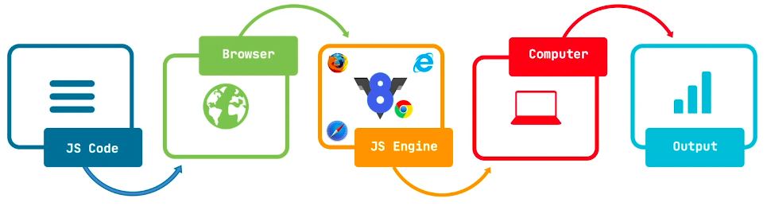

# Table Of Content

- [Table Of Content](#table-of-content)
  - [Closures](#closures)
  - [Hoisting](#hoisting)
  - [Prototype](#prototype)
  - [Prototype Inheritance \& ES6 Class](#prototype-inheritance--es6-class)
  - [`this` Keyword](#this-keyword)
    - [Implicit Binding](#implicit-binding)
    - [Explicit Binding](#explicit-binding)
    - [`new` Binding](#new-binding)
    - [`Window` Binding](#window-binding)
  - [Execution Context](#execution-context)
  - [Higher Order Functions](#higher-order-functions)

## Closures

- Inner function has access to the outer function's variables
- It's possible because of JavaScript's lexical scoping behavior

```js
var num1 = 1;
var num2 = 2;

var sum = function () {
  return num1 + num2;
};

console.log(sum());
console.dir(sum);
```


- Use `num1` & `num2`
- So, need to enclose outer function as `Closure` & global function as `Global`
- _Overall:_ Basically, if a function needs to access other variables which are not present in that function then it only stores the reference to that variable using closure
- Only stores the reference

```js

```

- output

## Hoisting

- A

## Prototype

- Return object from function

```js
function Person(name, age) {
  let person = {};

  person.name = name;
  person.age = age;

  person.eat = function () {
    console.log('Person is eating.');
  };

  person.sleep = function () {
    console.log('Person is sleeping.');
  };

  return person;
}

const sakib = Person('Sakib', 35);
sakib.eat(); // Output: Person is eating.
```

- I can do more obtimization
- `eat()` & `sleep()` methods can be the same as it's returning static output

```js
const personMethods = {
  eat: function () {
    console.log('Person is eating.');
  },
  sleep: function () {
    console.log('Person is sleeping.');
  },
};

function Person(name, age) {
  let person = {};

  person.name = name;
  person.age = age;

  person.eat = personMethods.eat;
  person.sleep = personMethods.sleep;

  return person;
}

const sakib = Person('Sakib', 35);
sakib.eat(); // Output: Person is eating.
```

- But I can't reference to `personMethods` if I use `Object.create()` instead
- `Object.create()` creates an object from an existing object

```js
const personMethods = {
  eat: function () {
    console.log('Person is eating.');
  },
  sleep: function () {
    console.log('Person is sleeping.');
  },
};

function Person(name, age) {
  let person = Object.create(personMethods);

  person.name = name;
  person.age = age;

  return person;
}

const sakib = Person('Sakib', 35);
sakib.eat(); // Output: Person is eating.
```

- _Prototype:_
- It's a property of any Javascript function that points to an object

```js
function myFunc() {
  console.log('Hello World');
}

console.dir(myFunc);
console.dir(myFunc.prototype); // Output: Object
```


- Using prototype

```js
function Person(name, age) {
  let person = Object.create(Person.prototype);

  person.name = name;
  person.age = age;

  return person;
}

// Share everything what I need with this 'Person' function
Person.prototype = {
  eat() {
    console.log('Person is eating.');
  },
  sleep() {
    console.log('Person is sleeping.');
  },
};

const sakib = Person('Sakib', 35);
sakib.eat(); // Output: Person is eating.
```

- Using constructor function & `new` keyword

```js
// Constructor function
function Person(name, age) {
  this.name = name;
  this.age = age;
}

Person.prototype = {
  eat() {
    console.log('Person is eating.');
  },
  sleep() {
    console.log('Person is sleeping.');
  },
};

// Using 'new' keyword
const sakib = new Person('Sakib', 35);
sakib.eat(); // Output: Person is eating.
```

- So, class convertion from prototype inheritance

```js
class Person {
  constructor(name, age) {
    this.name = name;
    this.age = age;
  }

  eat() {
    console.log('Person is eating.');
  }

  sleep() {
    console.log('Person is sleeping.');
  }
}

const sakib = new Person('Sakib', 35);
sakib.eat(); // Output: Person is eating.
```

## Prototype Inheritance & ES6 Class

- Prototype chaining
- pic
- starts from 18:00

## `this` Keyword

- 4 Rules of `this`
  - Implicit Binding
  - Explicit Binding
  - New Binding
  - Window Binding

### Implicit Binding

- Only works for normal function
- Otherwise `this` will be equal to `window` object
- _Example: 01_

```js
let sakib = {
  name: 'Sakib',
  age: 22,
  printPlayerName: function () {
    console.log(this.name);
  },
};

sakib.printPlayerName(); // Output: Sakib
```

- _Example: 02_

```js
let printPlayerNameFunction = function (obj) {
  obj.printPlayerName = function () {
    console.log(this.name);
  };
};

let sakib = {
  name: 'Sakib',
  age: 35,
};

printPlayerNameFunction(sakib);
sakib.printPlayerName(); // Output: Sakib
```

- _Example: 03_

```js
let Person = function (name, age) {
  return {
    name: name,
    age: age,
    printName: function () {
      console.log(this.name);
    },
    father: {
      name: 'Mr. XXX',
      printName: function () {
        console.log(this.name);
      },
    },
  };
};

let sakib = Person('Sakib', 22);
sakib.printName(); // Output: Sakib
sakib.father.printName(); // Output: Mr. XXX
```

### Explicit Binding

- Using `call` method & passing 1st arguments as object
- Mentioning this object should point as `this`
- Rest parameters are unlimited

```js
let printPlayerName = function (v1, v2, v3) {
  console.log(`${this.name} is ${v1}, ${v2} & ${v3}`);
};

let sakib = {
  name: 'Sakib',
  age: 22,
};

let v1 = 'Handsome';
let v2 = 'Allrounder';
let v3 = 'Best Player';

printPlayerName.call(sakib, v1, v2, v3);
// Output: Sakib is Handsome, Allrounder & Best Player
```

- So, `this` is pointing `sakib` object
- Using `apply` method & passing 1st arguments as object
- Mentioning this object should point as `this`
- Rest parameters should be an array which contains unlimited length

```js
let printPlayerName = function (v1, v2, v3) {
  console.log(`${this.name} is ${v1}, ${v2} & ${v3}`);
};

let sakib = {
  name: 'Sakib',
  age: 22,
};

let v1 = 'Handsome';
let v2 = 'Allrounder';
let v3 = 'Best Player';

let v = [v1, v2, v3];

printPlayerName.apply(sakib, v);
// Output: Sakib is Handsome, Allrounder & Best Player
```

- Using `bind` method
- Main difference is returning an instance

```js
let printPlayerName = function (v1, v2, v3) {
  console.log(`${this.name} is ${v1}, ${v2} & ${v3}`);
};

let sakib = {
  name: 'Sakib',
  age: 22,
};

let v1 = 'Handsome';
let v2 = 'Allrounder';
let v3 = 'Best Player';

// Return an instance
let newf = printPlayerName.bind(sakib, v1, v2, v3);
newf();
// Output: Sakib is Handsome, Allrounder & Best Player
```

### `new` Binding

```js
function Person(name, age) {
  // let this = Object.create(null);
  this.name = name;
  this.age = age + 5;
  console.log(`${this.name} is ${this.age} years old`);
  // return this;
}

let sakib = new Person('Sakib', 35);
// Output: Sakib is 40 years old
```

### `Window` Binding

- When `this` is pointing `window` object is call `window` binding

```js
let printName = function () {
  console.log(this); // Output: 'window' object
  console.log(window === this); // Output: true
  console.log(this.name); // Output: undefined
};

let sakib = {
  name: 'Shakib',
};

printName();
```

- If use `use strict`, then this behavior is not happening

```js
'use strict';
let printName = function () {
  console.log(this); // Output: undefined
  console.log(window === this); // Output: false
  console.log(this.name); // Output: Uncaught TypeError: Cannot read properties of undefined (reading 'name')
};

let sakib = {
  name: 'Shakib',
};

printName();
```

## Execution Context

- Browser takes JS Code
- Using V8 Engine, JS code is turned into machine code
- That machine code is understandable to the computer
- Computer understands that code & show some outputs



## Higher Order Functions

- _Higher Order Function:_
  - Passing more than one functions as an arguments
  - Returning one function from another function
  - Or both properties can be present at the same time
- _Example: 01_

```js
function hello() {
  return function () {
    console.log('Hello World!');
  };
}

hello(); // Output: Hello World!
```

- _Example: 02_ Customize `array.map()` built-in function

```js
const languages = ['Javascript', 'Python', 'Java', 'C++'];

// Higher Order Function
function myMap(arr, fn) {
  const output = [];
  for (let i = 0; i < arr.length; i++) {
    output.push(fn(arr[i]));
  }
  return output;
}

const result = myMap(languages, (language) => {
  return language.length;
});
console.log(result);
// Output: [10, 6, 4, 3];
```
