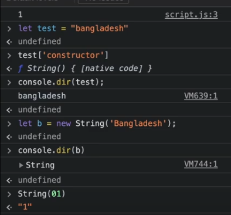
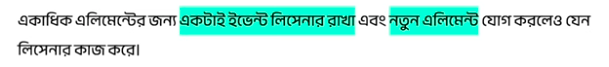

# Table Of Content

- [Table Of Content](#table-of-content)
- [JavaScript: Tips \& Tricks](#javascript-tips--tricks)
  - [_Question-01:_ Remove falsy values from any array](#question-01-remove-falsy-values-from-any-array)
  - [_Question-02:_ Convert any value to boolean](#question-02-convert-any-value-to-boolean)
  - [_Question-03:_ Resizing any array](#question-03-resizing-any-array)
  - [_Question-04:_ How to flattern a multi-dimensional array](#question-04-how-to-flattern-a-multi-dimensional-array)
  - [_Question-05:_ Short Conditional](#question-05-short-conditional)
  - [_Question-06:_ Replace all occurances of a string](#question-06-replace-all-occurances-of-a-string)
  - [_Question-07:_ Know performance of a task](#question-07-know-performance-of-a-task)
  - [_Question-08:_ Swapping values without any extra value](#question-08-swapping-values-without-any-extra-value)
  - [_Question-09:_ Destructuring Aliases](#question-09-destructuring-aliases)
  - [_Question-10:_ Get value as data type](#question-10-get-value-as-data-type)
  - [_Question-11:_ Remove duplicate from an array](#question-11-remove-duplicate-from-an-array)
  - [_Question-12:_ Compare two arrays by value](#question-12-compare-two-arrays-by-value)
  - [_Question-13:_ Shuffling array](#question-13-shuffling-array)
  - [_Question-14:_ Comma Operator](#question-14-comma-operator)
  - [_Question-15:_ Output of `[] + []`](#question-15-output-of---)
  - [_Question-16:_ Output of the function? - Template Literals](#question-16-output-of-the-function---template-literals)
  - [_Question-17:_ Output of the function? - `arguments`](#question-17-output-of-the-function---arguments)
  - [_Question-18:_ What is the output of `a[a](01)`?](#question-18-what-is-the-output-of-aa01)
  - [_Question-19:_ What is the output of `0.1 + 0.2`?](#question-19-what-is-the-output-of-01--02)
  - [_Question-20:_](#question-20)
  - [_Question-21:_ Make a function that sorts its arguments without using loops](#question-21-make-a-function-that-sorts-its-arguments-without-using-loops)
  - [_Question-22:_ Count duplicate elements in an array](#question-22-count-duplicate-elements-in-an-array)
  - [_Question-23:_ Reverse words in a string](#question-23-reverse-words-in-a-string)
  - [_Question-24:_ Sorting words by length in a sentence](#question-24-sorting-words-by-length-in-a-sentence)
  - [_Question-25:_ `setTimeout` along with `Promise()`](#question-25-settimeout-along-with-promise)
  - [Debounce Handling](#debounce-handling)
  - [Memoization](#memoization)
  - [Intersection Observer API](#intersection-observer-api)
  - [Javascript `Object.groupBy()`](#javascript-objectgroupby)
  - [Event Delegation](#event-delegation)
  - [Event Propagation](#event-propagation)
  - [JavaScript `NaN`](#javascript-nan)

# JavaScript: Tips & Tricks

## _Question-01:_ Remove falsy values from any array

```js
const miscellaneous = ['A', '', 'a', NaN, 'I'];

console.log(miscellaneous.filter(Boolean)); // Output: [ 'A', 'a', 'I' ]
```

- _NOTE:_ 6 falsy values are `false`, `0`, `undefined`, `''` `null`, `NaN`
- _Explanation:_
- `Boolean(expression)` - returns `true`/`false`
- _For Example:_
- `Boolean(5 < 6)` - return `true`
- `Boolean('')` - return `false`

## _Question-02:_ Convert any value to boolean

- _Way-01:_

```js
console.log(Boolean('Mashrafi')); // Output: true
console.log(Boolean(undefined)); // Output: false
console.log(Boolean(1)); // Output: true
console.log(Boolean(0)); // Output: false
```

- _Way-02:_

```js
console.log(!!'Mashrafi'); // Output: true
console.log(!!undefined); // Output: false
console.log(!!1); // Output: true
console.log(!!0); // Output: false
```

## _Question-03:_ Resizing any array

```js
let letters = ['A', 'N', 'L', 'I'];
console.log(letters); // Output: [ 'A', 'N', 'L', 'I' ]

letters.length = 3; // Resizing any array

console.log(letters); // Output: [ 'A', 'N', 'L' ]
```

## _Question-04:_ How to flattern a multi-dimensional array

- Convert from 2D array to 1D array using `flat()` method
- Enable to convert just one level 2D array like `[1, [2, 3], 4]`

```js
let letters = ['A', ['AA', 'BB'], 'C', ['AAA', 'CCC']];
letters.flat();
```

- _Output:_

```txt
[ 'A', 'AA', 'BB', 'C', 'AAA', 'CCC' ]
```

- Can't able to flat multi-level like `[1, [2], [3, [4]]]`

```js
let anotherLetters = ['A', ['AA', 'BB', ['AAA', 'DDD']], 'C', ['AAA', 'CCC']];
anotherLetters.flat();
```

- _Output:_

```txt
[ 'A', 'AA', 'BB', [ 'AAA', 'DDD' ], 'C', 'AAA', 'CCC' ]
```

- Multi-level array flatting

```js
anotherLetters.flat(Infinity);
```

- Output:

```txt
[
  'A',   'AA',  'BB',
  'AAA', 'DDD', 'C',
  'AAA', 'CCC'
]
```

## _Question-05:_ Short Conditional

- Using `if` statement

```js
const captain = 'Mashrafi';
if (captain === 'Mashrafi') {
  console.log('I love Mashrafi');
}
// Output: I love Mashrafi
```

- Instead of 'if' statement, using `&&`

```js
captain === 'Mashrafi' && console.log('I love Mashrafi');
// Output: I love Mashrafi
```

- If want to handle not matched partion

```js
const captain = 'Mashrafi2';
if (captain !== 'Mashrafi') {
  console.log('I hate Bangladesh');
}
// Output: I hate Bangladesh
```

- Instead of not matched statement, using `||`

```js
captain === 'Mashrafi' || console.log('I hate Bangladesh');
// Output: I hate Bangladesh
```

## _Question-06:_ Replace all occurances of a string

```js
const quote =
  'React is a Javascript framework & this framework is the most popular front-end framework right now';

// Replace all occurrences of 'framework' with 'library'
// g - global, i - case sen
quote.replace(/framework/g, 'library');

// Output:
// React is a Javascript library & this library is the most popular front-end library right now
```

- _TIPS:_ Log values with variables names smartly

```js
const name = 'Prince';
console.log({ name });
```

## _Question-07:_ Know performance of a task

```js
const startTime = performance.now();

for (let i = 0; i <= 50; i++) {
  console.log(i);
}

const endTime = performance.now();

console.log(`Loop took ${endTime - startTime} milliseconds to finish`);

// Output:
// Loop took 15.600313000380993 milliseconds to finish
```

## _Question-08:_ Swapping values without any extra value

- Using array distructuring

```js
let a = 1;
let b = 2;

[a, b] = [b, a];
console.log(a, b);

// Output: 2 1
```

- Using math

```js
let a = 1;
let b = 2;

b = a + (a = b) - b;
console.log(a, b);

// Output: 2 1
```

## _Question-09:_ Destructuring Aliases

```js
const language = {
  name: 'Javascript',
  founded: 1995,
  founder: 'Brendan Eich',
};

const { name, founder } = language; // Destructuring
console.log(name, founder);

const { name: languageName, founder: CreatorName } = language; // Destructuring Aliases
console.log(languageName, fCreatorNameounder);
```

## _Question-10:_ Get value as data type

```html
<input id="id1" type="text" value="123" />
```

- Normally, `document.querySelector('#id1')` must be a string value

```js
const element = document.querySelector('#id1').valueAsNumber;
console.log(typeof element);

// Output: number
```

## _Question-11:_ Remove duplicate from an array

```js
const array = [1, 2, 2, 3, 3, 3, 4, 5];

const removeDuplicates = [...new Set(array)];

// Output: [1, 2, 3, 4, 5]
```

## _Question-12:_ Compare two arrays by value

```js
const hasSameElements = (a, b) => {
  return a.length === a.length && a.every((value, index) => value === b[index]);
};

hasSameElements([1, 2], [1, 3]); // false
hasSameElements([1, 2], [1, 2]); // true
```

## _Question-13:_ Shuffling array

- Sorting

```js
const numbers = [1, 2, 3, 4, 5, 6];

numbers.sort((a, b) => a - b);
```

- _NOTE:_
- If `a - b` result is `-ve`, `a` is sorted before `b`
- If `a - b` result is `+ve`, `b` is sorted before `a`
- If `a - b` result is `0`, no changes
- But wants to shuffling the array

```js
const numbers = [1, 2, 3, 4, 5, 6];

numbers.sort(() => Math.random() - 0.5);

// Output:
// [1, 2, 3, 4, 5, 6] - 1st time
// [2, 4, 6, 3, 5, 1] - 2nd time
// [5, 2, 1, 5, 6, 3] - 3rd time
// And so on...
```

## _Question-14:_ Comma Operator

- The comma operator (`,`) evalutes each of its operands from left to right
- And returns the value of the last operand

```js
let x = 1;
x = (x++, x);

console.log(x); // Output: 2
```

- Another example:

```js
let y = (2, 3);

console.log(y); // Output: 3
```

- Complex example:

```js
let a = [[1, 2, 3, 4], [3, 4, 5], [5, 6], [7]];

for (let i = 0, j = 3; i <= 3; i++, j--) {
  console.log(`a[${i}][${j}] = ${a[i][j]}`);
}

// Output:
// a[0][3] = 4
// a[1][2] = 5
// a[2][1] = 6
// a[3][0] = 7
```

## _Question-15:_ Output of `[] + []`

- Without string & number, JavaScript do typecasting & convert to a string
- String conversion of `[]` is `''`
- String conversion of `{}` is `[object object]`

```js
console.log([] + []); // Output: ''
console.log({} + []); // Output: [object object]
```

- But, what about `true + 5`

```js
console.log(true + 5); // Output: 6
console.log(false + 5); // Output: 5
```

## _Question-16:_ Output of the function? - Template Literals

```js
function fn() {
  // Receives `hello` argument but not used
  return 'Bangladesh';
}

const string = fn`hello`; // Function calling with `hello` argument

console.log(string); // Output: Bangladesh
```

## _Question-17:_ Output of the function? - `arguments`

- By default, `this` takes all the parameters of the function
- Inside the `fn` function is referring to the length of the `arguments` object, which is `2`.

```js
function fn() {
  console.log(this); // Output: Arguments(2)
  // Output: Arguments[0] = fn()
  // Output: Arguments[1] = 5

  console.log(`The length is ${this.length}`);
}

let value = {
  length: 10,
  method: function (fn) {
    arguments[0]();
  },
};

value.method(fn, 5); // Output: The length is 2
```

## _Question-18:_ What is the output of `a[a](01)`?

```js
const a = 'constructor';
console.log(a[a](01));
console.log(a[a](11));
```

- Output:

```js
1;
11;
```

- _Reason:_
- `a[a]` refers to a constructor function of a string
- Which returns a string in object literal format (`new String()`)
- So, `a[a](01)` is nothing but `new String(01)` which returns `1`
- More clarification:



## _Question-19:_ What is the output of `0.1 + 0.2`?

- It can't find the right output as JS use base 2 numerical system
- So, they are infinitely repeating fractions in base 2

## _Question-20:_

- Code:

```js
console.log('bangladesh'.__proto__);
console.log('bangladesh'.__proto__.__proto__);
console.log('bangladesh'.__proto__.__proto__.__proto__);
```

- Output:

```txt
String (Object literal - new String())
Object (master object where String comes from)
null
```

## _Question-21:_ Make a function that sorts its arguments without using loops

- Code:

```js
const myFunc = function () {
  return [].slice.call(arguments).sort();
};

console.log(myFunc(2, 1, 4, 3));
```

- Output:

```txt
[1, 2, 3, 4]
```

- `[].slice` is used to use the `slice` method
- `call()` is used to pass the parameter in the `slice` method
- `sort()` is used to sort the array produced by `[].slice.call(arguments)`

## _Question-22:_ Count duplicate elements in an array

- Input:

```txt
['A', 'B', 'C', 'A', 'C', 'F', 'F', 'D', 'A']
```

- Output:

```txt
{ 'A': 3, 'B': 1, 'C': 2, 'D': 1, 'F': 2 }
```

- Code:

```js
const letters = ['A', 'B', 'C', 'A', 'C', 'F', 'F', 'D', 'A'];

function countDuplicates(data) {
  const output = {};

  // forEach() works as well
  data.map((item) => {
    output[item] = (output[item] || 0) + 1;
  });

  return output;
}

console.log(countDuplicates(letters));
```

## _Question-23:_ Reverse words in a string

- Input:

```txt
I love Bangladesh
```

- Output:

```txt
I evol hsedalgnaB
```

- Output:

```js
const str = 'I love Bangladesh';

function reverseWords(data) {
  const words = data.split(' ');

  const output = data.map((item) => {
    return item.split('').reverse().join('');
  });

  return output.join(' ');
}

console.log(reverseWords(str));
```

## _Question-24:_ Sorting words by length in a sentence

- Input:

```txt
Java is a programming language
```

- Output:

```txt
a is Java language programming
```

- Output:

```js
const str = 'Java is a programming language';

function sortWords(data) {
  const words = data.split(' ');

  data.sort((a, b) => {
    return a.length - b.length;
  });

  return data.join(' ');
}

console.log(sortWords(str));
```

## _Question-25:_ `setTimeout` along with `Promise()`

- `var i` - functional scope
- `let i` - block scope
- Web API takes `setTimeout` & done its task
- Can't use `await` with `setTimeout`, move to another function & set under `Promise`

```js
const DURATION = 1000;

const delay = (i) => {
  return new Promise((resolve) => {
    setTimeout(() => {
      resolve(i);
    }, i * DURATION);
  });
};

const timer = async (n) => {
  console.log('Starting...');
  for (let i = 1; i <= n; i++) {
    const result = await delay(i);
    console.log(result);
  }
  console.log('Ending...');
};

timer(5);
```

- Output:

```txt
Starting...
1
2
3
4
5
Ending...
```

## Debounce Handling

- Why do we use `debounce` handling?
- If I have a button for cart & by pressing that button, call an API & spend money based on the cart items
- If user click multiple times then backend will receive more than one request
- To prevent that bounce effect, we need debounce handling
- Actually, stop taking user's API request for a certain amount of times
- Debounce means prevent or stop bounce effect
- HTML source code:

```html
<div>
  <button id="button">Click Here</button>
</div>
```

- Debounce handling:

```js
cosnt button = document.getElementById('button');

// Debounce handler
function debounce(fn, delay) {
  let timerId;
  return function () {
    if (timerId) {
      clearTimeout(timerId);
    }

    timerId = setTimeout(() => {
      fn();
    }, delay);
  }
}

button.addEventListener('click', debounce(function () {
  console.log('Clicked');
}, 2000));
```

## Memoization

- Calculate huge calculation multiple times are resource waste
- Prevent huge costly calculation multiple times, use memoization
- Remember the previous calculation in a cache or variable & use it every times after the first time
- Need higher order function
  - Takes another function as a parameter
  - Return a new function
  - Takes another function as a parameter & returns a new function
- If values are static or single value or variable:

```js
const add = (x) => x + 10;

// Higher order function
const memo = (fn) => {
  const cache = {};

  return (x) => {
    if (cache[x]) {
      console.log('Returning from caching');
      return cache[x];
    }

    console.log('Caching for the first time');
    cache[x] = fn(x);
    return cache[x];
  };
};

const calculate = memo(add);
console.log(calculate(5));
console.log(calculate(5));
console.log(calculate(5));
console.log(calculate(5));
```

- Output:

```txt
Caching for the first time
15
Returning from caching
15
Returning from caching
15
Returning from caching
15
```

- If values are dynamic:

```js
// REST operator & 'x' is now an array
const add = (...x) => x.reduce((sum, currentVal) => sum + currentVal, 0) + 10;

const memo = (fn) => {
  const cache = {};

  return (...x) => {
    const key = JSON.stringify(x);
    if (cache[key]) {
      console.log('Returning from caching ', cache);
      return cache[key];
    }

    console.log('Caching for the first time, cache: ', cache);
    cache[key] = fn(...x);
    return cache[key];
  };
};

const calculate = memo(add);
console.log(calculate(10, 20, 30, 40));
console.log(calculate(10, 20, 30, 40));
console.log(calculate(10, 20, 30));
console.log(calculate(10, 20, 30));
```

- Output:

```txt
Caching for the first time, cache:  {}
110
Returning from caching  { '[10,20,30,40]': 110 }
110
Caching for the first time, cache:  { '[10,20,30,40]': 110 }
70
Returning from caching  { '[10,20,30,40]': 110, '[10,20,30]': 70 }
70
```

## Intersection Observer API

- A

## Javascript `Object.groupBy()`

- If I want the following output:

```txt
{
  scripting: [
    { title: 'Javascript', type: 'scripting' },
    { title: 'Java', type: 'scripting' }
  ],
  normal: [ { title: 'Python', type: 'normal' } ]
}
```

- So, prepare that output in normal way:

```js
const languages = [
  { title: 'Javascript', type: 'scripting' },
  { title: 'Java', type: 'scripting' },
  { title: 'Python', type: 'normal' },
];

let scriptingLanguages = {};
languages.map((language) => {
  const { type } = language;
  if (scriptingLanguages[type] === undefined) {
    scriptingLanguages[type] = [];
  }

  scriptingLanguages[type].push(language);
});

console.log(scriptingLanguages);
```

- But I can do the same work using `groupBy()` method
- _NOTE:_ Node JS & chrome version should be latest
- _NOTE:_ Need extra package `core-js` to run without Node JS latest version

```cmd
npm i core-js
```

```js
require('core-js');

let scriptingLanguages = {};
scriptingLanguages = Object.groupBy(languages, (lang) => lang.type);
console.log(scriptingLanguages);
```

## Event Delegation



- Normally I can use multiple event listeners for multiple elements
- But it's not working for adding another new element or for API
- Must use event delegation in this case
- _Condition of Event Delegation:_
  - One event listener for multiple elements
  - Should work that listener for adding another new element
- That element also work with that same listener but no need to add extra event listener
- _Why use event delegation?_
  - The elements are visible through API
  - The elements are updated dynamically

```html
<!DOCTYPE html>
<html lang="en">
  <head>
    <meta charset="UTF-8" />
    <meta name="viewport" content="width=device-width, initial-scale=1.0" />
    <title>Test</title>
  </head>
  <body>
    <ul>
      <li>Javascript</li>
      <li>PHP</li>
      <li>C++</li>
      <li>C</li>
      <li>Java</li>
    </ul>
    <button onclick="addNodeJS()">Add Node JS</button>
    <script src="1.js"></script>
  </body>
</html>
```

```js
// Grab the whole 'ul' element
const ul = document.querySelector('ul');

// Add click event on 'ul' element
ul.addEventListener('click', (event) => {
  // Find out 'li' element
  if (event.target.matches('li')) {
    // Perfect match on 'Javascript'
    if (event.target.innerText === 'Javascript') {
      event.target.style.backgroundColor = 'green';
    } else {
      event.target.style.backgroundColor = 'yellow';
    }
  }
});

// Event delegation on dynamic mode
const addNodeJS = () => {
  const newElement = document.createElement('li');
  newElement.innerText = 'Node JS';
  ul.appendChild(newElement);
};
```

## Event Propagation

- _Event Propagation:_ Execution order of all the event listeners

```html
<!DOCTYPE html>
<html lang="en">
  <head>
    <meta charset="UTF-8" />
    <meta name="viewport" content="width=device-width, initial-scale=1.0" />
    <title>Test</title>
  </head>
  <body>
    <main>
      <div>
        <button>Click Here</button>
      </div>
    </main>
    <script src="1.js"></script>
  </body>
</html>
```

```js
const main = document.querySelector('main');
const div = document.querySelector('div');
const button = document.querySelector('button');

const listener = (event) => {
  console.log(event.target);
};

main.addEventListener('click', listener);
div.addEventListener('click', listener);
button.addEventListener('click', listener);
```

- Output:

```txt
<button>Click Here</button>
<button>Click Here</button>
<button>Click Here</button>
```

- As, `event.target` refers to which element is being clicked
- I have clicked on the button so that `Click Here` is printed three times
- But use `event.currentTarget`:

```js
const listener = (event) => {
  console.log(event.currentTarget);
};
```

- Output:

```txt
<button>Click Here</button>
<div>...</div>
<main>...</main>
```

- So, printing order is from child to parent
- It's by default & called event bubbling
- _Event Bubbling:_ Event propagation moves from child to parant (default)
- `event.currentTarget` refers to the element itself
- `this` refers to the element itself

```js
const listener = (event) => {
  console.log(this); // Pointing to 'event.currentTarget'
};
```

- Output:

```txt
<button>Click Here</button>
<div>...</div>
<main>...</main>
```

- _Event Capturing or Trickling:_ Event propagation moves from parent to child
- It's opposite of Event Bubbling
- Need to add 3rd parameter like `{ capture: true }`

```js
const listener = (event) => {
  console.log(event.currentTarget);
};

main.addEventListener('click', listener, { capture: true });
div.addEventListener('click', listener, { capture: true });
button.addEventListener('click', listener, { capture: true });
```

- Output:

```txt
<main>...</main>
<div>...</div>
<button>Click Here</button>
```

- Looks similar:

```js
main.addEventListener('click', listener, true);
```

- _Tricky interview question:_
- If the flow should be: `DIV > BUTTON > MAIN`

```js
const listener = (event) => {
  console.log(event.currentTarget);
};

main.addEventListener('click', listener);
div.addEventListener('click', listener, true);
button.addEventListener('click', listener);
```

- Output:

```txt
<div>...</div>
<button>Click Here</button>
<main>...</main>
```

- _Explain:_
- While clicking on the button, Event Capturing is occuring as `div` element
- So, `div` hits first
- After that move to 3rd element as Event Capturing
- Now, `button` hits as Event Bubbling is occuring
- So, moves to `main` element

## JavaScript `NaN`

```js
const weird = NaN;
console.log(weird === weird); // Output: false
```

- Same as:

```js
const result1 = 'Sumit' / 5;
const result2 = 'Bad programmer' / 3;

console.log(result1); // Output: NaN
console.log(result2); // Output: NaN

console.log(result1 === result2); // Output: false
```

- _Tricky interview question:_

```js
const array = [NaN];
const result = array.includes(NaN);

console.log(result); // Output: true
```

- As, `array.includes()` uses different equality algorithm like `Same-value-zero equality`
- `Object.is()` is similar to same-value equality, but `+0` and `-0` are considered equal
